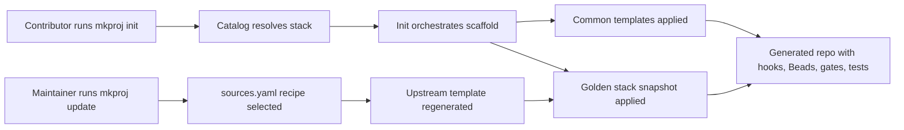

# mkproj

`mkproj` is a Go CLI that turns an empty directory into a fully configured, AI-native project with git, agent instructions, Beads, guard hooks, quality gates, and an initial walking skeleton.

This repository is the generator itself. It owns the embedded templates, stack snapshots, security floor, gate pipeline, and maintainer refresh workflow.

## What It Generates

V1 ships six stacks across three languages:

| Language | Project Type | Stack Key |
|---|---|---|
| Go | CLI | `go-cli-cobra` |
| Go | API | `go-api-chi` |
| Python | CLI | `python-cli-typer` |
| Python | API | `python-fastapi` |
| C# | CLI | `csharp-cli` |
| C# | API | `csharp-webapi` |

Each shipped stack is expected to scaffold a repo that can run `mise install` and `mise run ci` with at least one real passing test.

## How It Works



## How To Use

### Prerequisites

To build `mkproj` locally:

- Go `1.24.x`

To run `mkproj init` end to end, you also need:

- `git`
- `bd`
- `instill`
- `lefthook`
- stack-specific native tooling:
  - Go stacks: `cobra-cli` or `go`
  - Python stacks: `uv`
  - C# stacks: `dotnet`
- optional remote publishing:
  - `gh` for `--remote gh`

### Install The CLI

For the normal local developer install path:

```bash
make install
```

Override the destination directory when you do not want to write to `$HOME/.local/bin`:

```bash
make install BINDIR=/custom/bin
```

The default `make` target is `help`, so bare `make` shows the available targets:

```bash
make
make help
```

### Build The CLI

For a repo-local binary without installing it:

```bash
make build
```

Run the test target through the same command surface:

```bash
make test
```

Remove the repo-local build output:

```bash
make clean
```

Remove the installed binary from the selected install directory:

```bash
make uninstall
```

For one-off runs during development without writing `bin/mkproj`:

```bash
go run ./cmd/mkproj
```

### Quickstart

From an empty destination directory:

```bash
mkdir sample-app
cd sample-app
go run /path/to/agentic_template_start/cmd/mkproj init \
  --project-name "Sample App" \
  --language go \
  --project-type cli \
  --stack go-cli-cobra \
  --author-name "Ada Lovelace" \
  --author-email "ada@example.com" \
  --remote none
```

After generation, verify the scaffolded repository the same way an end user would:

```bash
mise install
mise run ci
```

### Scaffold A Project

Interactive:

```bash
go run ./cmd/mkproj
```

Fully non-interactive:

```bash
go run ./cmd/mkproj init \
  --project-name "Sample App" \
  --language go \
  --project-type cli \
  --stack go-cli-cobra \
  --author-name "Ada Lovelace" \
  --author-email "ada@example.com" \
  --remote none
```

Key flags:

- `--project-name`
- `--language`
- `--project-type`
- `--stack`
- `--author-name`
- `--author-email`
- `--remote gh|url|none`
- `--remote-url` when `--remote url`
- `--github-user` for GitHub module path derivation
- `--module-path` to override the derived module path
- `--bd-prefix` to override the derived Beads prefix

### Reconcile The Allowlist

Check whether a generated repo is stale without mutating it:

```bash
go run ./cmd/mkproj sync-allowlist --check
```

Rewrite only the managed allowlist block:

```bash
go run ./cmd/mkproj sync-allowlist
```

Include personal rules explicitly:

```bash
go run ./cmd/mkproj sync-allowlist --include-personal
```

### Refresh A Maintained Snapshot

`update` is a maintainer-only path for regenerating vendored stack snapshots from `sources.yaml`.

```bash
go run ./cmd/mkproj update --stack go-cli-cobra
```

When a stack snapshot changes, re-run the repo test suite before opening a PR:

```bash
GOCACHE=$PWD/.cache/go-build go test ./... -count=1
```

## Repository Layout

- `cmd/mkproj/`: CLI entrypoint and end-to-end smoke tests
- `internal/init/`: init lifecycle orchestration
- `internal/scaffold/`: phase-1 writer and asset composition
- `internal/allowlist/`: managed-block reconciliation and stale detection
- `internal/update/`: maintainer refresh path
- `internal/catalog/`: shipped v1 stack boundary
- `templates/common/`: shared generated assets for every scaffolded repo
- `templates/golden/`: per-stack vanilla snapshot plus overlay
- `sources.yaml`: pinned upstream recipes for maintainer refresh
- `docs/PRD.md`: product intent
- `docs/SPEC.md`: implementation truth
- `docs/adr/`: decision records
- `CONTEXT.md`: glossary
- `test/`: cross-cutting integration and policy tests

## How To Contribute

### Start With The Source Of Truth

Before changing behavior, read the relevant project docs:

- `docs/PRD.md` for product intent
- `docs/SPEC.md` for how the system is expected to behave
- `docs/adr/` for why a decision was made
- `CONTEXT.md` for domain language

Use `bd` for all task tracking:

```bash
bd prime
bd ready
bd show <id>
bd update <id> --claim
```

If work is not already tracked, create an issue before editing.

### Read Order For Changes

- Read `docs/SPEC.md` before changing behavior.
- Read `docs/PRD.md` when validating product intent or user value.
- Read the relevant ADR before changing an established invariant.
- Read `templates/common/AGENTS.md.tmpl` when the change affects generated repo instructions rather than the generator itself.

### Common Development Commands

Workflow commands:

```bash
make build
make test
make clean
GOCACHE=$PWD/.cache/go-build go test ./... -count=1
```

Focused checks that are often useful while iterating:

```bash
GOCACHE=$PWD/.cache/go-build go test ./cmd/mkproj ./internal/allowlist -count=1
GOCACHE=$PWD/.cache/go-build go test ./internal/update -count=1
GOCACHE=$PWD/.cache/go-build go test ./test -count=1
bats test/secret-scan.bats
```

### BDD And Review Expectations

- Add or update the closest behavior test before or alongside an implementation change.
- Prefer walking-skeleton or package-level tests for externally visible CLI behavior.
- Keep template updates paired with assertions that prove the generated result.
- Finish review feedback before starting the next slice of work.

### Contribution Workflow

1. Track the work in Beads.
2. Create a short-lived branch.
3. Make the smallest change that satisfies the relevant spec or issue.
4. Run focused tests first, then the full suite.
5. Commit with both co-author footers when agent-assisted.
6. Push the branch and open a PR.

### What To Edit For Common Changes

- CLI behavior: `cmd/mkproj/main.go` and the relevant `internal/*` package
- Shared generated repo files: `templates/common/`
- Stack-specific scaffold output: `templates/golden/<stack>/`
- Maintainer refresh recipes: `sources.yaml`
- Contributor instructions for generated repos: `templates/common/AGENTS.md.tmpl`
- Contributor instructions for this generator repo: root `AGENTS.md`

### Maintainer Notes

- Treat `sources.yaml` and `templates/golden/<stack>/` as a pair.
- Do not hand-edit generated snapshot output without checking whether the change belongs in the upstream recipe, overlay, or shared template.
- When changing contributor-facing behavior, update both the code and the docs that explain it.

### Contribution Invariants

- `mkproj init` MUST keep the empty-directory precondition.
- Generated repos MUST remain usable without `mkproj` installed.
- Guard behavior MUST stay deny-only.
- Local gates and CI MUST continue to converge on `mise run ci`.
- Maintainer refresh MUST preserve overlay ownership and deterministic output.

## Related Docs

- Project-specific agent instructions: [`AGENTS.md`](./AGENTS.md)
- Product requirements: [`docs/PRD.md`](./docs/PRD.md)
- Definitive specification: [`docs/SPEC.md`](./docs/SPEC.md)
- Domain glossary: [`CONTEXT.md`](./CONTEXT.md)
