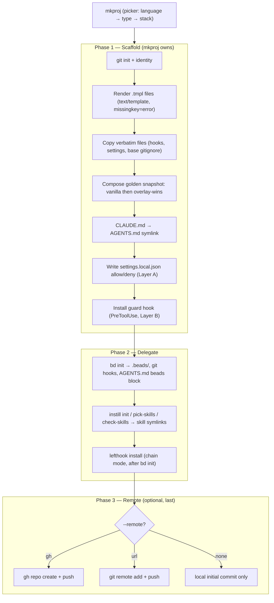
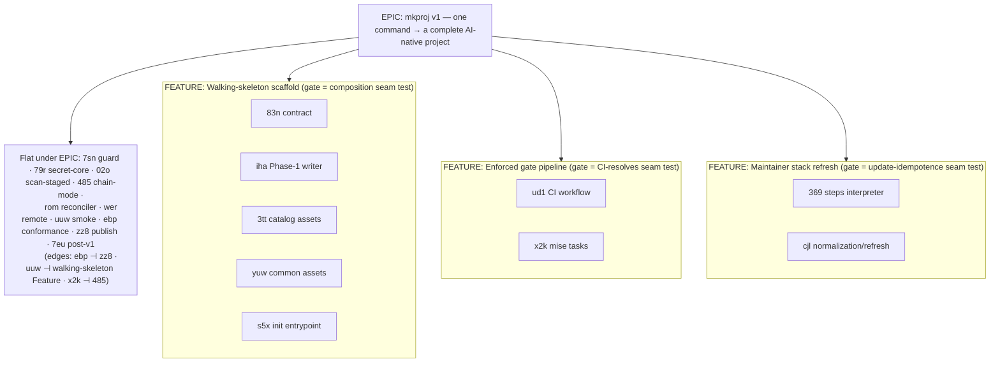

# mkproj — Definitive Specification

**Status:** canonical · 2026-06-20 · **Author:** Peter O'Connor with Claude Code (databricks-claude-opus-4-8)

This is the single authoritative specification of *how* `mkproj` works. It supersedes the five
mini-specs listed in §0. It cites — and does **not** restate — the decision records in
[`docs/adr/`](./adr/); when a section summarizes a decision in one line, the ADR is the full
truth. Product intent lives in [`PRD.md`](./PRD.md); domain vocabulary lives in
[`CONTEXT.md`](../CONTEXT.md).

---

## 0. Status, supersession & how to read this

### 0.1 Superseded documents

The following mini-specs are **superseded by this document** and have been archived to
`docs/superpowers/specs/_superseded/` for history. Do not implement from them.

| Archived spec | Subsumed into |
|---|---|
| `2026-06-16-mkproj-scaffolding-system-design.md` | §1, §3, §9, §11, §14, §17 (mined for engine, file manifest, day-one baseline) |
| `2026-06-18-allowlist-deny-floor-seed.md` | §11 (security model — full D1–D16 floor, seed contents, sandbox) |
| `2026-06-18-shared-secret-scan-design.md` | §12 (shared secret-scan) |
| `2026-06-19-mkproj-cli-prompt-render-contract.md` | §5, §6, §7, §10, §13, §15 |
| `2026-06-19-mkproj-init-lifecycle-and-topology.md` | §4, §8, §13, §16 |

The two `docs/handoffs/` documents and the `docs/superpowers/plans/` value-stream plan are
point-in-time artifacts, not specs; they are retained as-is.

### 0.2 Authority order

When two statements conflict, authority runs: **ADRs > this SPEC > everything else.** This SPEC
de-stales the older specs; where it cites an ADR, the ADR wins.

### 0.3 Decision records cited by this spec

ADR-0001 (per-project allowlist, embedded source) · ADR-0002 (deny-only guard hook) ·
ADR-0003 (one shared gate pipeline) · ADR-0004 (init fail-fast, no rollback) · ADR-0005
(stacks as walking-skeleton recipes) · ADR-0006 (update determinism & refresh seam) · ADR-0007
(engine: Go + text/template + embed.FS) · ADR-0008 (strict empty-dir precondition) · ADR-0009
(remote default gh, Phase-3-last, never auto-delete) · ADR-0010 (guideline is the conformance
floor, not the ceiling).

---

## 1. Problem, goal & the one verification test

Every new project costs 10–15 minutes of identical, drift-prone manual setup. `mkproj` collapses
that to one command (PRD §1–§2). The **single canonical acceptance test for the product**: run
init in an empty folder; the result must be indistinguishable from a hand-built project, with no
manual steps after. Every section below ends in Given/When/Then scenarios; if they pass, the
slice works.

A key framing finding (system-design §1): **`instill` and `bd` already perform most of the
scaffolding work**, so `mkproj` *orchestrates* them rather than reimplementing them.

---

## 2. Glossary

The domain vocabulary is maintained in [`CONTEXT.md`](../CONTEXT.md) and is not duplicated here.
Terms used throughout this spec — *golden snapshot, walking skeleton, overlay, allowlist, deny
floor, managed block, reconciler, guard hook, gate, guideline file* — are defined there. This
spec is implementation truth; `CONTEXT.md` is the language.

---

## 3. Architecture & engine

`mkproj` is a standalone Go binary using `text/template` + `embed.FS`, distributed as an offline,
vendored installed binary (**ADR-0007**). It **owns** templating, verbatim copy, symlink creation,
permissions, and guard-hook installation; it **delegates** to `bd` and `instill` for what they
already do well.



The engine choice, distribution, and offline/vendored posture are recorded in **ADR-0007**.

---

## 4. Init lifecycle

*(Authoritative: init-lifecycle spec §1; cites ADR-0004, ADR-0008, ADR-0009.)*

### 4.1 Precondition — strictly empty directory

`mkproj init` refuses to run unless the target directory is empty, ignoring only inert cruft
(`.DS_Store`). No `--force`/`--in-place` in v1 (**ADR-0008**).

### 4.2 Ordering invariants (load-bearing)

The ordered mutation is: Phase 1 (render/copy/link) → guard install → `bd init` → `instill
init`/`pick-skills`/`check-skills` → `lefthook install` → Phase 3 remote. Three orderings are
load-bearing:

- **Guard installs before `bd init`**, so beads' own git-hook install runs under the guard.
- **`lefthook install` runs after `bd init`** in chain/non-clobber mode, preserving beads' hooks
  (verification owned by `485`; cites ADR-0003).
- **Phase 3 runs last** (**ADR-0009**), so the first commit/push passes the full gate pipeline.

### 4.3 Failure posture — fail-fast, no rollback

On any step failure, init stops at that step, leaves the partial state, and prints the failed
step plus the single recovery command (recursive-force-delete the dir, then retry). No
transactional rollback — the empty-dir precondition bounds the blast radius to a disposable
directory (**ADR-0004**).

### 4.4 Phase 3 remote failure — leave & instruct, never auto-delete

`gh repo create` fails → report, remain a complete local-only repo, tell the user how to add a
remote manually. Repo created but first push fails → leave the remote, print its URL and the
`git push -u origin <branch>` retry, mention `gh repo delete` as the user's option. mkproj
**never** auto-deletes a remote (**ADR-0009**).

```gherkin
Scenario: Init refuses a non-empty directory
  Given the current directory contains a file
  When the user runs `mkproj init`
  Then it exits non-zero with "directory not empty" and creates nothing

Scenario: Local-step failure leaves a recoverable partial and no remote
  Given an empty dir and an interactive run targeting --remote gh
  When `instill init` fails during Phase 2
  Then init stops with "init failed at step 'instill init'", names the dir and the
       recursive-force-delete recovery command, and no GitHub repo was created

Scenario: Remote created but first push fails (gate or network)
  Given Phase 3 created the GitHub repo successfully
  When the initial `git push` fails
  Then mkproj reports the URL and reason, prints the push retry, does NOT delete the remote,
       and leaves the local repo complete
```

---

## 5. CLI & command surface

*(Authoritative: CLI/render contract §2.)*

- `mkproj` — **defaults to `init`** (bare invocation == `mkproj init`).
- `mkproj init` — scaffold a new project in the current dir (Phases 1–3).
- `mkproj update` — maintainer-only snapshot refresh (§15).
- `mkproj sync-allowlist [--check]` — reconciler (§13).

```gherkin
Scenario: Bare invocation defaults to init
  Given an empty directory
  When the user runs `mkproj`
  Then it behaves identically to `mkproj init`
```

---

## 6. Variable schema & prompt flow

*(Authoritative: CLI/render contract §1, §3.)*

**Seed (prompted/flagged, un-derivable):** project name, language, type, stack, remote choice.
**Author identity** auto-defaults from `git config --global user.{name,email}`, prompted only if
absent.

**Derived (computed from the project-name slug; each has an override flag, never a prompt):**

| Variable | Derivation | Override flag |
|---|---|---|
| `BdPrefix` | lowercased, non-alphanumeric-stripped slug | `--bd-prefix` |
| `ModulePath` | `github.com/<gh-user>/<ProjectName>` when `--remote gh`; else editable placeholder | `--module-path` |
| Go module / Python package (`snake_case`) / C# namespace (`PascalCase`) | normalized slug | (language-specific) |

**Prompt order:** project name → language → type → stack → author identity (confirm-or-edit the
git-config default) → remote (last; the one outward-facing action). Type is filtered to what
exists for the chosen language; stack to language × type. Only shipped v1 stacks appear (§9).

**Three-state precedence (per input):** (1) flag present → use it, skip the prompt silently; (2)
flag absent + TTY → prompt; (3) flag absent + no TTY → **error naming the missing flag** (never a
default). Invalid flag value → fail immediately listing valid choices, never drop to a prompt.

```gherkin
Scenario: Derivations from a single project-name seed
  Given the project name "My Cool API"
  When mkproj resolves the variable set
  Then BdPrefix == "mycoolapi" And the Python package == "my_cool_api"
       And the C# namespace == "MyCoolApi"

Scenario: Missing required value with no TTY fails loudly
  Given no --stack flag and no TTY
  When mkproj runs
  Then it exits non-zero naming --stack as the missing flag

Scenario: Only v1 stacks are selectable
  Given an interactive run with language=Go
  When the stack picker renders
  Then only Go v1 stacks (go-cli-cobra, go-api-chi) are offered
```

---

## 7. Render contract

*(Authoritative: CLI/render contract §4; cites ADR-0007.)*

- **Engine:** Go `text/template` with `Option("missingkey=error")` — an unresolved variable is a
  hard failure, never `<no value>`.
- **Renderable marker:** filename ends in `.tmpl` → render and strip the suffix. Every other file
  is copied **verbatim** (byte-for-byte).
- **File roles:** `render` (`.tmpl`), `verbatim`, `link` (symlink), `delegate` (produced by
  `bd`/`instill`/native tooling).
- The guard hook and `secret-scan.sh` are **`verbatim`** — security-critical scripts are
  identical and independently auditable across every repo; never templated.

```gherkin
Scenario: Phase-1 writer produces a clean tree (iha definition-of-done)
  Given a fixture variable set and the embedded templates/ tree
  When the Phase-1 scaffold writer runs into a temp dir
  Then no rendered file contains "<no value>" or a residual "{{"
       And every verbatim file is byte-identical to its source
       And CLAUDE.md is a symlink whose target is AGENTS.md
       And .claude/hooks/guard and .claude/hooks/secret-scan.sh are mode 0755

Scenario: A missing variable fails the render
  Given a template referencing {{.Undefined}}
  When the writer renders it
  Then init fails with an error naming the missing key And no partial file is written
```

---

## 8. Deterministic asset composition

*(Authoritative: init-lifecycle spec §2, §3, §5.)*

### 8.1 `.gitignore` merge

Output = base section, a banner, then the language section — concatenated verbatim, base first.
No interleaving, no sorting, **no dedup** (git treats duplicate patterns as harmless). Each
section is byte-identical to its source, so the same inputs always produce byte-identical output.

### 8.2 Managed-block topology

Three managed blocks across two files, coexisting by unique named marker. Each reconciler
rewrites only between its own markers; outside-block and inter-block content is sacred.

| File | Block | Owner | Reconciled? |
|---|---|---|---|
| `AGENTS.md` | beads block | `bd` | bd's own cadence |
| `AGENTS.md` | `MKPROJ CONVENTIONS` (Co-Authored-By, conventional-comments, <300-line PR norm) | mkproj | **render-once** — no version, no reconciler (v1) |
| `.claude/settings.local.json` | `MKPROJ ALLOW v:N` | `mkproj sync-allowlist` | versioned + reconciled |

Only the allowlist block carries version + reconciler machinery (keeps `rom` scoped to one block).

### 8.3 Skill-manifest topology

A **single** committed `.claude/skill-manifest.json` is the sole lockfile. `instill check-skills`
regenerates **both** `.claude/skills/` and `.agents/skills/` from it (instill lands only one
manifest and populates both trees). Both symlink trees are gitignored; the manifest is the
committed portable lockfile. No per-agent manifest, no drift.

```gherkin
Scenario: Gitignore merge is deterministic and sectioned
  Given the base .gitignore and the vendored Python github/gitignore
  When the Phase-1 writer produces the project .gitignore for a Python stack
  Then output is the base section, a "# ===== python ... =====" banner, then the python section,
       each section byte-identical to source, and running the merge twice is byte-identical

Scenario: Multiple managed blocks coexist without clobbering
  Given an AGENTS.md with a beads block, a MKPROJ CONVENTIONS block, and hand-written prose
  When `mkproj sync-allowlist` runs (targets settings.local.json, not AGENTS.md)
  Then AGENTS.md is untouched And only the allowlist block in settings.local.json is rewritten

Scenario: One manifest feeds both agents' skill trees
  Given a single committed .claude/skill-manifest.json
  When `instill check-skills` runs on a fresh clone
  Then .claude/skills/ and .agents/skills/ are both regenerated with the same skill set
```

---

## 9. Template catalog & overlay model

*(Authoritative: ADR-0005; de-staled system-design §4.)*

Each stack is a **golden snapshot** (vanilla, recipe-produced) plus exactly **one**
`.mkproj-overlay/` (the vetted opinions). The earlier name "security overlay" is **retired** —
audit/security tooling is one *part* of the single overlay, not a separate layer. The composed
output (vanilla + overlay) must be a **walking skeleton**: it runs end-to-end with ≥1 real passing
test (CONTEXT.md; ADR-0005). The walking skeleton is an emergent property of composition, not a
third layer.

### 9.1 v1 catalog — Go, Python, C# only (six stacks)

| Stack key | Language | Type |
|---|---|---|
| `go-cli-cobra` | Go | CLI |
| `go-api-chi` | Go | API |
| `python-cli-typer` | Python | CLI |
| `python-fastapi` | Python | API |
| `csharp-cli` | C# | CLI |
| `csharp-webapi` | C# | API |

TypeScript, Rust, and Bash are **deferred** until their guideline files exist (ADR-0003); the
catalog boundary is executable (`01b`) so unsupported stacks are non-selectable.

### 9.2 Sourcing — `sources.yaml` recipe schema

A stack's vanilla layer is the output of a **recipe** (which may be multi-step), declared in
`sources.yaml` with one uniform schema: `{kind: scaffolder|recipe, ordered steps[], gitignore:
<stem>, normalize: [...], resolved: {written by update only}}`. A single-scaffolder stack is a
one-step recipe. `go-api-chi` is `kind: recipe` (pinned checkout of `golang-standards/project-layout`
+ `go mod init` + `go get` of pinned chi/zap/viper/testify); its wired `main.go` + handler test
live in the **overlay**, not vanilla. gitignore mapping: Go→`Go`, Python→`Python`, C#→`VisualStudio`,
each resolved against one repo-wide pinned SHA (top-level `gitignore_repo` key). Full schema and
rationale: **ADR-0005**.

### 9.3 Packaging boundary

Everything under `templates/golden/<key>/.mkproj-overlay/` is the vetted, refresh-immune layer;
everything else under the stack dir is vanilla/refreshable. Overlay files may layer *into* vanilla
dirs — init composes **vanilla-first, then overlay-wins** on path collision, stripping the
`.mkproj-overlay/` prefix. The walking-skeleton test ships in the overlay next to the wiring it
exercises (non-vacuous-test guarantee; §16).

---

## 10. Enforced gate pipeline

*(Authoritative: ADR-0003; CLI/render contract §7; init-lifecycle §6.)*

One gate definition, multiple callers — no local/CI drift. `mise.toml` holds `[tools]` (toolchain
+ lefthook) and `[tasks]` (`lint`/`fmt`/`test`/`ci`). **lefthook** runs fast checks
(secret-scan + lint + format) on `pre-commit` and full tests on `pre-push`, calling the mise tasks.
**GitHub Actions** calls the same `mise run ci` (§ below). lefthook installs in chain mode after
`bd init`.

### 10.1 Overlay tool table (de-staled — xUnit, pyright, no NUnit/mypy)

Every overlay tool traces to a canonical guideline file; the conformance test (`ebp`) enforces the
**floor** (§10.2).

| | Format | Lint | Test | Mock | Coverage | Type | Audit |
|---|---|---|---|---|---|---|---|
| **Go** | `gofmt` | `golangci-lint` | `testing` + `go-cmp` | *(none — idiomatic fakes)* | `go test -cover` | — | `govulncheck` |
| **Python** | `ruff format` | `ruff` | `pytest` | `pytest-mock` | `pytest-cov` | `pyright` | `pip-audit` |
| **C#** | `dotnet format` | StyleCop.Analyzers | **xUnit** | NSubstitute | coverlet | nullable refs | `dotnet list package --vulnerable` |

### 10.2 Conformance semantics — guideline is the floor, not the ceiling

The guideline file is the **minimum** source of truth (CONTEXT.md; **ADR-0010**). The `ebp`
conformance test **fails when a guideline MUST has no corresponding overlay tool** (the overlay is
missing something required). It does **not** fail when the overlay ships a vetted extra the
guideline is silent on. Consequently `FluentAssertions` (C#) and `pytest-mock` (Python), if present
as vetted extras, require **no guideline edit**.

### 10.3 CI workflow shape

One **language-agnostic** `ci.yml`, identical across all stacks: checkout → install mise →
`mise install` → `mise run ci`. No inline lint/test/format. Triggers `on: [push, pull_request]`;
no scheduled run in v1. Verification asserts every shipped overlay's `mise.toml` defines a `ci`
task that `mise run ci` resolves to — the contract coupling `ud1` to `x2k` (see Seam Inventory §18).

```gherkin
Scenario: Overlay satisfies the guideline floor (ebp)
  Given a scaffolded Python project with its overlay applied
  When the ebp conformance test parses python.md against the overlay
  Then every MUST/SHOULD tool in python.md (ruff, pyright, pytest, pytest-cov, pip-audit) is present
       And a vetted extra absent from python.md does NOT fail the test
       And a shipped template with no guideline-backed language DOES fail the test

Scenario: One CI workflow calls mise run ci and references a real task
  Given any shipped v1 stack
  When its scaffolded .github/workflows/ci.yml is inspected
  Then it checks out, installs mise, runs `mise install`, then `mise run ci`,
       contains no inline lint/test/format, and the stack's mise.toml defines a resolvable `ci` task
```

---

## 11. Security model — allowlist & deny floor

*(Authoritative: allowlist/deny-floor seed spec; cites ADR-0001, ADR-0002. De-stales system-design
§6: colon-glob form, deny-only guard, D1–D16, path-token D9.)*

### 11.1 Two distinct concepts, one source file

**Allowlist** — convenience, always-growing, author-vetted command prefixes that remove the
confirmation prompt; per-project versioned managed block; canonical definition embedded in the
binary; reconciled notify-only (ADR-0001). **Deny floor** — stable, safety-oriented, blocks the
irreversible; enforced by the guard hook as a **deny-only net** (ADR-0002). Both live in one
canonical embedded source file (separate sections), refreshing on independent cadences.

### 11.2 Two enforcement layers + posture

- **Layer A — `settings.local.json` permissions** (declarative, coarse): allow/deny globs.
- **Layer B — guard hook** (PreToolUse, deny-only): splits compounds, blocks if any constituent
  is denied, **never approves**. Wired identically by Claude Code and Codex (both honor `exit 2`).
  Runs in every permission mode; auto mode bypasses the prompt but never the guard.
- **Glob format:** `Bash(tool:*)` (colon form). The param-style `Bash(command:rm *)` is silently
  ignored by Claude Code — never use it. `*` matches across spaces (ADR-0002).
- **Compounds auto-approve natively** when every constituent matches an allow rule (the native
  matcher is shell-operator-aware). The guard never approves compounds (ADR-0002). The seed's job
  is to make the allowlist complete; compounds then work for free.
- **Default posture: allow by default.** Commands matching neither allow nor deny **run** — the
  deny floor is a safety net, not an allowlist jail.

### 11.3 Deny floor — D1–D16

| # | Rule | Decision |
|---|---|---|
| D1 | `rm -rf` / recursive-force delete (any flag order) | block |
| D2 | `git rm -rf` / mass cached removal | block |
| D3 | `git push --force`/`-f` to a protected branch (`main master develop release/* production`) | block |
| D4 | history-rewriting push to a protected branch | block |
| D5 | `DROP DATABASE`/`DROP SCHEMA`/`dropdb`/`TRUNCATE` (no WHERE) | block |
| D6 | `mkfs*`, `dd of=/dev/*`, `> /dev/sd*`, fork bombs, `chmod -R 777 /`, `chmod 777` | block |
| D7 | `git reset --hard` / `git clean -fdx` / `git checkout .` discarding work | block |
| D8 | `git commit --no-verify`/`-n`, `--no-gpg-sign` (never bypass commit hooks) | block |
| D9 | **Secret path-token scan:** any command line referencing a secret path token (`.env`, `.env.*`, `*.pem`, `*.key`, `id_rsa*`, `id_ed25519*`, `credentials`, `*secret*`, `*.tfstate`, `.ssh/`, `.aws/`, `.gnupg/`, git-ref forms `HEAD:.env`) — **regardless of binary** (`cat`/`awk`/`python -c`/`git show`/`tar -O`/`base64`/`$(<…)`) | block |
| D10 | **Env-dump verbs:** bare `env`, `printenv`, `set`, `export -p`, `declare -p/-x`, `typeset -p`, `compgen -v`, `/proc/*/environ`, `launchctl getenv` | block |
| D11 | **Exfil channels:** `curl`, `wget`, `nc`, `ncat`, `socat`, `scp`, `sftp`, `rsync`, clipboard (`pbcopy`/`xclip`/`xsel`/`wl-copy`), `/dev/tcp/`+`/dev/udp/`, DNS-exfil | block |
| D12 | **System/process control:** `sudo`, `kill`/`killall`/`pkill`, `shutdown`/`reboot` | block |
| D13 | **Remote shells:** `ssh` | block |
| D14 | **Destructive docker:** `docker rm`/`rmi`/`system prune` | block |
| D15 | **Shell history:** `history`, `fc -l` | block |
| D16 | **Interpreter-class (belt-and-suspenders):** `bash -c`, `sh -c`, `zsh -c`, `eval`, `python -c`, `python3 -c`, `node -e`, `perl -e`, `ruby -e` | block |

> **D9 is a path-token scan, not a command-name list** (ADR-0002). A name list is trivially
> bypassed (`python3 -c 'open(".env")'`, `awk '1' .env`, `git show HEAD:.env`) and is explicitly
> rejected. **Documented irreducible gaps** (a string hook cannot close these): obfuscated paths
> inside interpreter one-liners, raw `git cat-file -p <sha>` / `git stash show -p` (no path token),
> hard-link/inode reuse, secrets already exported before the session. The OS sandbox is the backstop.

### 11.4 Seed contents

- **Universal allow (every project):** version control (`git status/diff/log/add/commit/...`,
  `gh pr/api/repo create/...`), toolchain (`bd:*`, `instill:*`, `mise:*`, `lefthook:*`), file ops
  (`ls/cat/head/tail/mkdir/cp/mv/ln/chmod/touch/find/...`), text processing
  (`grep/rg/fd/jq/sed/awk/sort/...`), misc shell (`echo/printf/date/xargs/timeout/bash`), and
  native Claude tools (`Read Glob Grep Edit Write WebSearch`).
- **Per-stack slice (only the project's stack):** Go → `Bash(go:*)`; Python →
  `python/python3/uv/pip/pytest/ruff/pyright/...`; C# → `Bash(dotnet:*)`.
- **Personal section** (tagged block; stripped by default, included via `--include-personal`):
  `gw/rtk/slack-cli`, cloud CLIs, `brew`, `docker` read ops.
- **Deliberately OUT** (stay prompting/denied): `curl`, `wget` — the remaining command-layer exfil
  control; use the `WebFetch` tool instead. These also sit on the deny floor (D11).

### 11.5 OS sandbox (both agents; FS isolation, network ON)

Claude (`sandbox.enabled` + per-path `denyRead` of `~/.ssh`, `~/.aws`, `~/.gnupg`) and Codex
(`sandbox_mode = "workspace-write"`, `network_access = true`). **Network is ON** — network-off
breaks day-one `git push`/`gh repo create`/`bd dolt push`/dependency installs; egress is controlled
by the guard's D11 exfil deny, accepting that OS-level exfil protection is traded for zero friction.
Asymmetry: Codex lacks per-path `denyRead` and a domain allowlist (ADR-0002).

```gherkin
Scenario: Guard is deny-only and terminal
  Given auto mode and a command matching a deny rule
  When the PreToolUse guard runs
  Then it exits 2 with a reason on stderr And the command never runs
       And the guard never returns an allow-decision for any command

Scenario: A vetted compound auto-runs without the guard approving it
  Given `git status:*` and `grep:*` are on the allowlist
  When the agent emits `git status && grep foo .`
  Then the native matcher auto-approves both constituents And the guard does not block
```

---

## 12. Shared secret-scan

*(Authoritative: secret-scan spec; cites ADR-0003. Note: the spec file's name matches a D9 token,
so read it with `cat`, not the Read tool.)*

One `.claude/hooks/secret-scan.sh` (POSIX bash, verbatim, mode 0755) implements seed rules **D9**
(path-token scan) + **D10** (env-dump verbs) and nothing else — D1–D8 and D11–D16 are the guard
hook's separate concern. Two modes over a shared core:

| Mode | Caller | Input | Blocks |
|---|---|---|---|
| `scan-command` | agent guard (PreToolUse) | command line (JSON on stdin, or `--command`) | D9 path-token refs + D10 env-dump verbs |
| `scan-staged` | lefthook pre-commit | `git diff --cached --name-only` | staged files whose path matches a secret pattern |

**Shared core:** one `SECRET_PATTERNS` array, one `EXEMPT_PATTERNS` carve-out (`*.example`,
`*.sample`, `*.template` — checked first), one matcher used by both modes. **Exit contract:** `0`
clean / `2` block + reason on stderr / `64` usage. Missing stdin or not-a-git-repo → `0` (never
crash the agent). The future guard composes `secret-scan.sh scan-command`; lefthook calls
`secret-scan.sh scan-staged`. This is the shared-script half of ADR-0003's defense-in-depth.

```gherkin
Scenario: D9 blocks a secret path regardless of binary
  Given a scan-command payload whose command displays a dotenv file
  Then it exits 2 with a D9 reason naming the token
       And awk on a dotenv, `git show HEAD:.env`, a .pem display, and a .aws/credentials
           reference all block

Scenario: D10 blocks bare env dumps but allows filtered ones
  Given bare `env`, `printenv`, `set`
  Then each blocks And `env | grep -v SECRET` is allowed

Scenario: scan-staged blocks staged secrets, allows examples
  Given a staged `.env` (and separately a staged `.env.example`)
  Then committing the `.env` is blocked And the `.env.example` commits clean
       And no staged files / outside a git repo exits 0
```

---

## 13. Reconciler & SessionStart wiring

*(Authoritative: CLI/render contract §6; init-lifecycle §4; cites ADR-0001.)*

**Staleness detection — monotonic integer.** The binary embeds `ALLOW_VERSION`; the managed block
carries `v:N`. `embedded > block` → stale. A guard test asserts "if the seed file changed in a
commit, `ALLOW_VERSION` changed too" (forgot-to-bump backstop).

**SessionStart hooks — both agents, same three in order, always exit 0:**

1. `bd prime` (beads context)
2. `instill check-skills` (skill-symlink reconciliation)
3. `mkproj sync-allowlist --check` (staleness notice — advisory, last so most visible)

Order is for readability; no hook depends on another's output. Every mkproj-authored hook **exits
0 always** and **no-ops silently if `mkproj` is missing** (`command -v mkproj || exit 0`) — a
scaffolded repo opens cleanly on a machine without mkproj. The mutating `mkproj sync-allowlist`
(no `--check`) stays human-invoked; the `--check` hook never mutates and never blocks.

```gherkin
Scenario: Stale allowlist notifies without blocking
  Given a managed block at v:5 and embedded ALLOW_VERSION = 7
  When the SessionStart hook runs `mkproj sync-allowlist --check`
  Then it prints a "2 versions behind" notice, exits 0, and the managed block is unchanged

Scenario: Missing mkproj binary never breaks session start and is silent
  Given a collaborator's machine without mkproj on PATH
  When SessionStart fires the sync-allowlist --check hook
  Then the hook exits 0 and prints nothing And bd prime + instill check-skills still ran
```

---

## 14. Agentic baseline — every repo, day one

*(Authoritative: system-design §8.)*

Beyond permissions, every scaffolded repo ships: an **ADR scaffold** (`docs/adr/` + MADR template);
a **`CONTEXT.md` glossary stub**; **Codex full parity** (shared guard, allowlist equivalent, skill
access — not just `bd prime`); a **`MKPROJ CONVENTIONS` block** in `AGENTS.md` (Co-Authored-By
footer, conventional-comments, <300-line PR norm); and **gitignored instill artifacts**
(`.claude/skills/` + `.agents/skills/` symlinks machine-local; `skill-manifest.json` committed).

---

## 15. Maintainer update path

*(Authoritative: CLI/render contract §8; cites ADR-0005, ADR-0006. Maintainer-only, online.)*

`mkproj update` refreshes all stacks by default; `--stack <key>` scopes to one. Each run: execute
the recipe's ordered steps (`checkout`/`run`, with per-step `strip:` on a `checkout`) in a temp dir (`369`) → run the per-stack
normalization pass over the **vanilla layer only** → write the snapshot into
`templates/golden/<key>/` → re-pin `sources.yaml`. It **regenerates vanilla only — never
`.mkproj-overlay/`** — and **fails loudly** naming any missing native scaffolder. Rebuilding the
binary is a separate manual step after the maintainer reviews the diff.

**Determinism (ADR-0006):** contracted by an **idempotence test**, not an exhaustive up-front rule
list. Normalization rules are per-stack `normalize:` blocks in the `sources.yaml` row (variance is
tool-specific). `captured:` means last-*changed*, not last-*run*. **Refresh seam:** after
regenerating vanilla, check committed overlay paths against the new vanilla tree — **orphan** (overlay
parent dir gone) = hard fail, write nothing, name paths; **collision** (new vanilla file at an
overlay path) = loud warn, complete the write (overlay-wins still correct).

```gherkin
Scenario: Update refreshes the snapshot but preserves the overlay
  Given the maintainer repo with a pinned go-cli-cobra snapshot and overlay
  When `mkproj update --stack go-cli-cobra` runs
  Then templates/golden/go-cli-cobra/ reflects new output
       And .../go-cli-cobra/.mkproj-overlay/ is byte-identical And sources.yaml records the ref/SHA

Scenario: Update is idempotent when upstream is unchanged
  When the maintainer runs `mkproj update --stack <key>` twice with no upstream change
  Then templates/golden/<key>/ is byte-identical And .mkproj-overlay/ is untouched
       And git diff is empty

Scenario: Refresh seam fails loud on an orphaned overlay file
  Given an upstream refresh removes the vanilla parent dir of a committed overlay file
  When update runs
  Then it exits non-zero naming each orphaned path And writes nothing
```

---

## 16. Verification & smoke tiers

*(Authoritative: init-lifecycle §7; smoke-cleanup contract added 2026-06-20 grill-with-docs.)*

Two tiers prove the "indistinguishable from hand-built" promise. Because `mise run ci` includes
`test` (ADR-0003), green CI inherently proves the snapshot's starter test passes — therefore
**every shipped golden snapshot MUST ship at least one real passing test** (owned by `3tt`) so
`mise run test` is never vacuously green.

### 16.1 Local smoke (every run, hermetic, offline)

`mkproj init --stack <key> --remote none` (the primary consumer of `--remote none`) → `mise
install` → `mise run ci` exits 0 → clean initial commit through pre-commit gates → **assert no
network access occurred**.

### 16.2 Full golden path (gated behind gh credentials; nightly/opt-in)

`--remote gh` end to end → remote created → first push passes pre-push → CI green on the remote.

### 16.3 Smoke teardown — ephemeral by construction (no leaked artifacts)

The full-tier smoke **creates its repo under a dedicated throwaway namespace** (e.g.
`mkproj-smoke-<runid>`), runs its assertions, then **deletes the repo in a `trap`/`defer` so
teardown fires even on mid-test failure**, and finally **asserts the repo no longer exists**
(cleanup is verified, not assumed).

> **Hard invariant — the test's delete-remote is a separate code path from the product's
> never-delete-remote (ADR-0009).** The product (`wer`) MUST NEVER delete a user's repo; the smoke
> harness MUST always delete its own. These two paths must never be conflated — wiring the test's
> teardown into product code would risk deleting user data.

```gherkin
Scenario: Local smoke proves a scaffolded stack works offline
  Given an empty dir
  When `mkproj init --stack <key> --remote none`, then `mise install`, then `mise run ci`
  Then the repo contains mise.toml, lefthook.yml, and ci.yml
       And `mise run ci` exits 0 (running >=1 real test)
       And an initial commit succeeds through the pre-commit gates
       And no network/GitHub access occurred

Scenario: Snapshot tests are not vacuous
  Given any shipped v1 stack
  When its starter test is removed and `mise run test` is run
  Then `mise run test` fails

Scenario: Full-tier smoke leaves no artifacts, even on failure
  Given gh credentials are available
  When the full golden-path smoke runs and an assertion fails mid-test
  Then the throwaway remote is still deleted by the teardown trap
       And the harness asserts the repo no longer exists
       And no product code path performed the deletion
```

---

## 17. File manifest

*(Authoritative: system-design §7.)*

Roles: **[embed]** compiled in · **[render]** templated at init · **[verbatim]** copied as-is ·
**[link]** symlinked · **[delegate]** produced by `bd`/`instill`/native tooling.

```
mkproj/                              # source repo
├── cmd/mkproj/main.go               # CLI entrypoint: init (default), update, sync-allowlist
├── internal/
│   ├── scaffold/                    # Phase 1: render, copy, symlink, settings, guard
│   ├── delegate/                    # Phase 2: shell out to bd + instill + lefthook install
│   ├── remote/                      # Phase 3: gh repo create / git remote add
│   ├── prompt/                      # interactive picker (language → type → stack)
│   ├── catalog/                     # stack-key matrix + resolution (01b — exists)
│   └── update/                      # maintainer recipe interpreter + normalization (369, cjl)
├── sources.yaml                     # [maintainer] pinned upstreams (recipe rows; §9.2)
├── templates/                       # ── all embed.FS ──
│   ├── common/
│   │   ├── gitignore.base           # [verbatim] multi-language base .gitignore
│   │   ├── AGENTS.md.tmpl           # [render]
│   │   ├── claude/{settings.json, settings.local.json.tmpl, hooks/{guard, secret-scan.sh}}
│   │   ├── codex/hooks.json         # [verbatim]
│   │   └── skill-manifest.json.tmpl # [render]
│   ├── gitignore/                   # [embed] vendored github/gitignore per language
│   └── golden/<key>/                # [embed] pinned snapshots + .mkproj-overlay/ per v1 stack
└── docs/                            # PRD.md, SPEC.md, adr/, handoffs/, superpowers/

# Scaffolded output (what the verification test inspects):
myproject/
├── .git/                  [delegate]   ├── AGENTS.md          [render] + beads block
├── .gitignore  base+lang merged        ├── CLAUDE.md → AGENTS.md  [link]
├── .claude/{settings.json, settings.local.json, hooks/{guard, secret-scan.sh}, skill-manifest.json}
├── .codex/hooks.json                   ├── .beads/            [delegate]
├── mise.toml, lefthook.yml, .github/workflows/ci.yml
└── <composed golden tree>  vanilla + overlay, rendered
```

---

## 18. Seam Inventory — cross-component couplings & their owning tests

*(New in this spec. Zero-silos is structural: every coupling between work items names the single
test that owns the boundary. A seam without a named owning test is a defect, surfaced like a
contradiction. Scheduling is enforced via the Epic → Feature → Story structure in beads, where a
Feature's `all-children` gate IS the seam test.)*

| Seam | Components | Owning test (where it lives) | Scheduling |
|---|---|---|---|
| **Composition** | `83n` (contract) × `iha` (Phase-1 writer) × `3tt` (catalog assets) × `yuw` (common assets) × `s5x` (init entrypoint that invokes composition end-to-end) | **Walking-skeleton Feature gate**: `mkproj init --stack <key> --remote none` composes correctly → `mise run ci` green → ≥1 real test passes, offline. MAY prove with one stack first; MUST cover all six to close. | Feature `all-children` gate; pulled forward as the first user-visible milestone. |
| **CI resolves** | `ud1` (CI workflow) × `x2k` (mise `ci` task) | **Gate-pipeline Feature gate**: every shipped overlay's `mise.toml` defines a `ci` task that `mise run ci` resolves to, across all v1 stacks. | Feature `all-children` gate. |
| **Update idempotence** | `369` (steps interpreter) × `cjl` (normalization/refresh) | **Maintainer-refresh Feature gate**: `mkproj update --stack <key>` run twice with no upstream change → `templates/golden/<key>/` byte-identical, overlay untouched, git diff empty. | Feature `all-children` gate. |
| **Conformance fixture** | `zz8` (publish guidelines) → `ebp` (conformance test) | Precondition, not a composition seam: `ebp` can resolve the three guideline files at their canonical path. | Plain `blockedBy` edge (`ebp` blocked-by `zz8`). |
| **Chain-mode hooks** | `485` (verify beads hooks survive `lefthook install`) → `x2k` (real multi-job lefthook) | `485` proves chain mode in isolation; the local smoke (§16.1) exercises pre-commit/pre-push at runtime without duplicating the `485` proof. | `x2k` blocked-by `485` (existing edge). |

### 18.1 Work hierarchy (Epic → Feature → Story)



---

*Authored By Peter O'Connor with Assistance from Claude Code (databricks-claude-opus-4-8) · 2026-06-20 · mkproj definitive specification*
