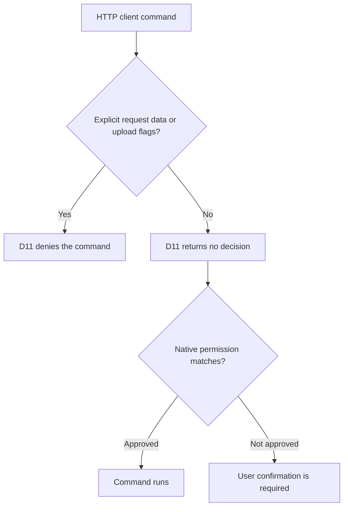

# D11 blocks explicit HTTP uploads, not HTTP clients

**Status:** accepted · 2026-07-12 · amends ADR-0002 D11 egress policy

## Context

D11 originally denied `curl` and `wget` by executable name. That made the guard terminal for
ordinary API reads and authentication probes, including commands that discard the response body
and emit only an HTTP status. The rule confused the presence of a network client with evidence of
an exfiltration attempt.

The guard is a deny-only safety net. It MUST block dangerous command structure, but it MUST NOT
become an allowlist jail for routine network reads. Native tool permissions remain responsible for
explicit approval because `curl` and `wget` are not in the universal allowlist.

## Decision

D11 MUST inspect HTTP-client arguments:

- Ordinary `curl` and `wget` reads, HEAD requests, and authentication probes MUST NOT be denied by
  D11.
- `curl` options that provide request data, forms, uploads, configuration-driven behavior, URL
  query data, or variable expansion MUST be denied.
- `wget` options that provide POST or request-body data from values or files MUST be denied.
- Raw transfer, remote-copy, clipboard, socket, and DNS channels MUST remain denied.
- `curl` and `wget` MUST remain outside the universal allowlist. Passing D11 means only that the
  guard did not deny the command; it MUST NOT emit an allow decision.

## Considered Options

- **Continue denying every HTTP client invocation.** Rejected because routine API reads and
  response-suppressed authentication probes become impossible, even with explicit user approval.
- **Remove HTTP clients from D11 without inspecting arguments.** Rejected because explicit file and
  request-body uploads would lose the command-layer safety net.
- **Add destination-specific hostnames to the generated guard.** Rejected for this fix because a
  growing service registry would mix repository policy with the stable deny floor. Destination
  authorization MAY be designed separately if native permission prompts prove insufficient.

## Consequences

- D11 is intentionally a structural tripwire, not a complete egress firewall.
- Commands using headers or authentication options can intentionally transmit credentials to the
  selected endpoint. The user or calling agent MUST choose the destination correctly.
- The OS sandbox, native permission layer, D9 secret-path scan, and D10 environment-dump denial
  remain independent controls.
- The source and generated-template guard copies MUST remain byte-identical.

*Authored By Peter O'Connor with Assistance from Codex (GPT-5) · 2026-07-12 · forge D11 HTTP-client policy*
