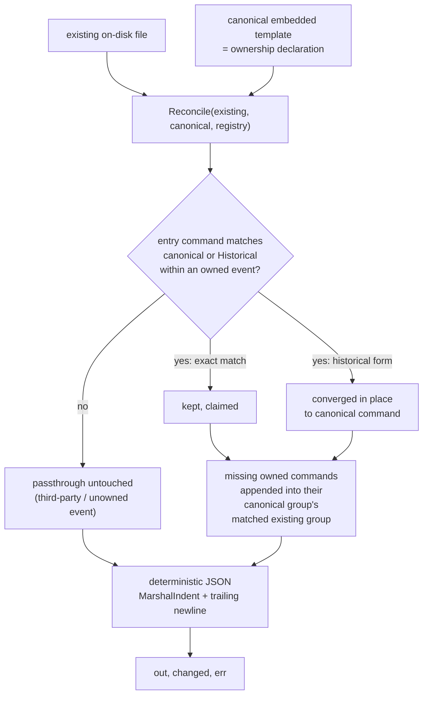

# Co-owned agent config is reconciled by owned-entry identity, never blind-overwritten

**Status:** accepted · 2026-08-30

## Context

`forge upgrade` treats most managed files (`.claude/hooks/guard`, `.claude/hooks/secret-scan.sh`,
`.opencode/plugins/forge-hooks.js`) as wholly forge-owned: it can byte-copy the embedded template
over the on-disk file unconditionally, because nothing else writes to them. `.claude/settings.json`
and `.codex/hooks.json` are different — they are **co-owned**. Other tools installed into the same
repo append their own entries into the same `hooks` object: `bd prime --hook-json` writes a
`SessionStart` matcher group, and `.beads/hooks/agent-fitness-functions-*` writes `PreToolUse`
matcher groups, including matcher strings ("Bash", "") that duplicate forge's own.

Defect B is a real incident, not a hypothetical: in the `todo-cli` repo, `forge upgrade` blind-
overwrote `.claude/settings.json`, deleting bd's `SessionStart` hook entry and both
`agent-fitness-functions-*` `PreToolUse` groups. The file is strict JSON — there is no comment
syntax, and even if there were, an LLM-driven agent asked to add a hook is just as likely to edit
the JSON directly as to respect a marker convention nothing enforces at parse time.

The reconciliation problem is harder than the allowlist reconciler (ADR-0001) because ownership
here cannot be scoped to a single managed block: forge's own entries are interleaved, by design,
inside the same top-level `hooks` object and often the same matcher groups as third-party entries.
Real fixture data (`internal/hookcfg/reconcile_test.go`, mirroring the `todo-cli` file at its last
good commit) also shows: matcher strings are not unique keys (two groups can both declare `"Bash"`
or `""`); commands can be machine-absolute paths outside forge's control; and whole top-level events
(`PreCompact`) can exist that forge has never declared and must not touch.

This ADR covers the reconciliation *engine* only (`internal/hookcfg`, pure, no file I/O). Wiring it
into `forge upgrade`'s write path — including the manifest/version-gate interaction and permission
repair — is explicit follow-up scope in the next unit of this epic.

## Decision

**Ownership is per-entry, identified by command string, not per-matcher-group and not per-file.**
The canonical embedded template (`templates/common/claude/settings.json`,
`templates/common/codex/hooks.json`) is the ownership declaration: every command string that
appears anywhere in the canonical template's `hooks` object is a forge-owned entry. Nothing else is
declared ownership — there is no separate registry of "these are forge's matchers." A matcher group
is never itself owned; only the individual command entries inside it are.

`internal/hookcfg.Reconcile(existing, canonical []byte, reg Registry) (out []byte, changed bool, err
error)` merges the two:

- **Owned entries** appear exactly once in the output, converged to their canonical shape
  (`{"type":"command","command":"<canonical string>"}`).
- **`Registry.Historical`** maps a current owned command to prior shipped forms of that same
  command (e.g. `"bd prime || true"` was previously shipped as bare `"bd prime"`). A historical
  fingerprint found inside an event the canonical template owns is claimed and replaced in place —
  never left as a stale duplicate alongside the current form. Claiming is scoped per owning event:
  a bare `"bd prime"` living inside a third-party `PreCompact` group (an event forge does not
  declare) is not touched, because forge has made no ownership claim over that event at all.
- **Missing owned entries are appended**, not recreated from scratch — into the existing matcher
  group that already carries a sibling entry from the same canonical group, so a user's or a fitness
  function's edits to that group's shape (extra unrelated fields, reordering) survive.
- **Everything unclaimed passes through untouched**: third-party matcher groups, third-party entries
  interleaved inside partially-forge-owned groups, and entire events forge never declared
  (`PreCompact`). Relative order and occurrence counts are preserved exactly — no duplication, no
  reordering of foreign content.
- **Non-hooks top-level keys**: the existing file's value always wins (a populated `enabledPlugins`
  or a user's `permissions` block is never clobbered); canonical supplies a key only when the
  existing file is missing it entirely.
- **Fail loud, never guess**: malformed existing JSON returns `(nil, false, err)` and writes nothing.
  There is no repair-by-inference path for unparseable input — the caller (the next unit's
  `upgrade.Run` wiring) is responsible for surfacing the error rather than silently skipping
  reconciliation.
- **Deterministic, fixed-point serialization**: output is `json.MarshalIndent` with 2-space indent
  plus a trailing newline. Go's `encoding/json` sorts `map[string]any` keys alphabetically on
  marshal, which is already deterministic — reconciling already-reconciled output is a no-op
  (`changed == false`) and produces byte-identical bytes, matching the update-determinism discipline
  established in ADR-0006 for the maintainer-side refresh pipeline. This engine extends that same
  "idempotence is the contract" principle to the generated-repo-side reconciler.

## Considered Options

- **Region markers inside the hooks JSON (mirroring ADR-0001's allowlist block).** Rejected: illegal
  inside strict JSON — there is no comment syntax to carry a `// BEGIN FORGE` marker, and any
  workaround (a sentinel string field) would need every co-owning tool to respect a convention
  nothing enforces at parse time. The `todo-cli` incident is exactly a case of another tool (`bd`)
  correctly *appending* a new entry rather than rewriting a region — region markers solve a problem
  this file doesn't have and don't solve the one it does.
- **Delegated re-install: on upgrade, shell out to re-run each detected co-owner's own installer
  (`bd prime --hook-json`, etc.) to regenerate their entries.** Rejected: requires forge to enumerate
  and trust an unbounded set of third-party installers, produces non-deterministic output across
  differently-installed-tool-version repos, and — critically — silently discards any entry a human
  hand-authored directly in the file rather than through a tool's installer. The engine must treat
  "an entry I don't own" as data to preserve, not a signal to regenerate.
- **Status quo: blind-overwrite the whole file from the canonical template.** Rejected: this is
  Defect B itself, the `todo-cli` incident this ADR exists to close. It is the simplest possible
  implementation and it is actively destructive to any other tool sharing the file.

## Consequences

- `internal/hookcfg` is a new, purely functional package (no file I/O, stdlib only) — easy to test
  exhaustively against fixture data and the real embedded templates without touching disk.
- Wiring `Reconcile` into `forge upgrade`'s write path for `.claude/settings.json` and
  `.codex/hooks.json` — including how `Registry.Historical` fingerprints get populated across infra
  versions, and how a `Reconcile` error should affect the upgrade's exit status — is explicit
  follow-up scope for the next unit of this epic (`agentic_template_start-dpr.5`).
- Any future co-owned managed file that shares this `hooks`-object schema can reuse
  `internal/hookcfg.Reconcile` directly; a file with a different schema needs its own reconciler,
  not a generalization of this one — the entry-identity model here is intentionally specific to the
  matcher-group hooks shape, not a generic JSON-merge tool.
- Because ownership is declared entirely by what's present in the canonical template, adding or
  removing a forge-owned hook entry in a future release is just an edit to
  `templates/common/claude/settings.json` / `templates/common/codex/hooks.json` — no separate
  ownership manifest to keep in sync.

*Authored By Peter O'Connor with Assistance from Claude Code (claude-sonnet-5) · 2026-08-30 · forge
co-owned hook config reconciler*
