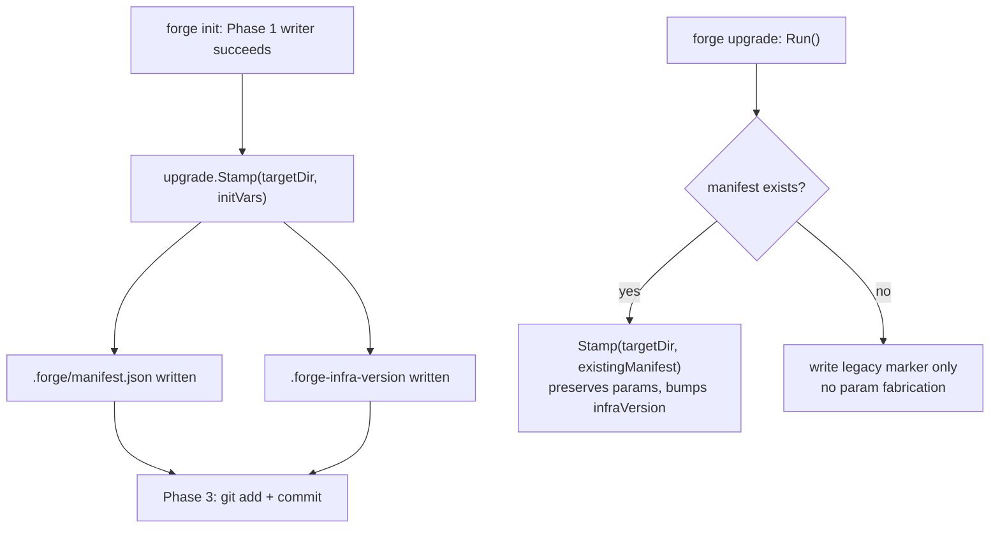

# init persists a committed forge manifest; bare integer marker becomes legacy fallback

**Status:** accepted · 2026-08-30

## Context

`forge init` never stamped `.forge-infra-version`. A freshly scaffolded repo was therefore born at
infrastructure version 0, and the SessionStart `forge upgrade --check` hook (wired into both
`.claude/settings.json` and `.codex/hooks.json`) nagged on every single session from the moment the
repo existed, even though it was already current with the embedded template.

Separately, `.forge-infra-version` is a bare integer with no room for context. `forge upgrade` can
overwrite the fixed set of unparameterized managed files (`.claude/hooks/guard`,
`.claude/hooks/secret-scan.sh`, `.claude/settings.json`, `.codex/hooks.json`,
`.opencode/plugins/forge-hooks.js`) unconditionally, but it cannot safely re-render a file like
`opencode.jsonc` that is templated with init-time parameters (`language`, `frontend`,
`includePersonal`, `stack`) — those parameters exist only in memory during `forge init` and are
discarded once the process exits. ADR-adjacent SPEC §19 already carves `opencode.jsonc` out of
upgrade-management for exactly this reason, deferring full re-render support to a follow-up unit.

This unit (PR2 of the `agentic_template_start-dpr` epic) closes the "born at v0" defect and lays the
groundwork — a durable, committed record of init params — that the follow-up unit needs to restore
full upgrade-management of parameterized files.

## Decision

`forge init` writes a committed `.forge/manifest.json` immediately after the Phase 1 scaffold writer
succeeds (`internal/init/init.go`, before Phase 2 delegation and Phase 3's `git add`/`commit`), so
the manifest rides the initial scaffold commit alongside every other generated file:

```json
{
  "schemaVersion": 1,
  "infraVersion": 4,
  "language": "go",
  "frontend": "",
  "includePersonal": false,
  "stack": "go-cli-cobra"
}
```

- `schemaVersion` versions the manifest's own field set, independent of `infraVersion`.
- `infraVersion` is the embedded-template version the repo was last stamped with — the same value
  the bare `.forge-infra-version` marker used to carry alone.
- The four param fields are the init inputs `forge upgrade` needs to re-render templated files
  correctly in a later unit.
- No timestamps: the manifest must be deterministic, matching the byte-identity discipline the
  codebase already applies to `forge update` (ADR-0006).

`internal/upgrade.Stamp(targetDir, m)` is the single write path for both files: it forces
`schemaVersion` and `infraVersion`, writes `.forge/manifest.json`, and writes the legacy
`.forge-infra-version` marker (`"%d\n"`) in the same call, so the two can never drift out of sync.
`forge init` calls `Stamp` with the resolved init vars; `forge upgrade` calls `Stamp` with the
existing manifest's params (if a manifest is present) so a mutating upgrade advances `infraVersion`
without losing `language`/`frontend`/`includePersonal`/`stack`. A legacy repo with no manifest yet
gets only the bare marker rewritten — `forge upgrade` does not invent params for repos it cannot
know the init history of; backfill-by-inference is explicitly deferred to a later unit.

`readOnDiskVersion` prefers the manifest's `infraVersion` when a manifest exists, falling back to
the bare marker for repos scaffolded before the manifest existed and for any tooling that only
understands the legacy format.



## Considered Options

- **Marker-only: keep `.forge-infra-version` as the sole file, just stamp it at init.** Rejected:
  fixes the v0-nag defect but does nothing for defect E — a bare integer cannot carry init params,
  so `opencode.jsonc` (and any future parameterized managed file) stays permanently excluded from
  upgrade-management rather than temporarily excluded pending this groundwork.
- **Replace the marker outright with the manifest.** Rejected: breaks `validateForgeRepo`'s marker
  detection and any v3-or-earlier `forge` binary a user might still have installed, which only knows
  `.forge-infra-version`. Both files must coexist, with the marker demoted to a legacy fallback
  rather than removed.
- **Infer params at every upgrade instead of persisting them.** Rejected: fragile and, in
  `includePersonal`'s case, outright impossible — there is no on-disk signal that reliably
  reconstructs whether a repo was scaffolded with personal-context inclusion. Persisting the
  manifest at the one point the params are known (init time) is the only sound source of truth.

## Consequences

- `.forge/manifest.json` is committed (confirmed `templates/common/gitignore.base` has no `.forge`
  pattern) so it travels with the repo through clones and forks, not just the machine that ran init.
- `forge upgrade` on a legacy repo (marker only, no manifest) still cannot re-render parameterized
  files — that capability, and the backfill-by-inference path for legacy repos, is explicit
  follow-up scope (this epic's PR5).
- Two files must be kept mutually consistent going forward; `Stamp` is the only writer for either,
  so no other code path may touch `.forge-infra-version` or `.forge/manifest.json` directly.
- SPEC.md §19 gains a "Freshly scaffolded repo is born current" scenario and the §17 file manifest
  now lists both files under the scaffolded-output tree.
- The backfill path promised here (this epic's PR5) is best-effort, not fail-loud: when a legacy
  repo's params are uninferable, `forge upgrade` skips writing `.forge/manifest.json` and prints a
  notice rather than failing the run — infra reconciliation must never block on a manifest it
  cannot honestly construct.

*Authored By Peter O'Connor with Assistance from Claude Code (claude-sonnet-5) · 2026-08-30 · forge
infra-version manifest*
