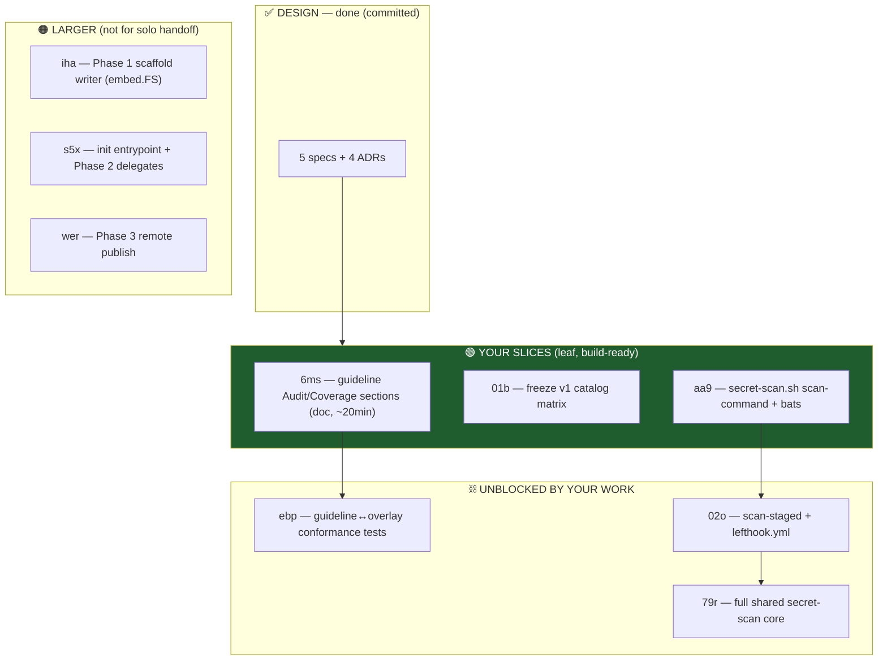

# Implementation Brief — first work slices for a guided engineer

**Date:** 2026-06-20 · **Branch:** `chore/remove-calm-guard-refs` · **Repo:** agentic_template_start
**Prepared for:** a junior/guided engineer taking the first runnable slices.
**Read this top to bottom once before claiming any issue.**

---

## 0. What this project is (60-second orientation)

`mkproj` is an opinionated Go CLI that scaffolds a brand-new, AI-native project repo in one
shot — rendering templates, copying security scripts verbatim, symlinking agent config,
delegating to native scaffolders (`cobra-cli`, `uv`, `dotnet`), wiring up skills, and
optionally publishing a remote. The v1 catalog ships **Go, Python, and C# only**.

The design phase is **done** (17 questions closed in a grill-with-docs session, all with
runnable Given/When/Then criteria). **No production code exists yet** — no `go.mod`, no
`.go` files, no `.claude/hooks/`. You are writing the first lines.

Two pillars matter for the slices below:
- **A deny-only security floor** — a PreToolUse guard hook + lefthook pre-commit both call
  one shared `secret-scan.sh`. One pattern list, one matcher, two callers.
- **Guideline files are canonical** — every tool an overlay installs must trace to a
  written MUST/SHOULD in a language guideline file (ADR-0003). A conformance test enforces
  this.

---

## 1. Context you must read first

| Doc | Why it matters to you |
|---|---|
| `CLAUDE.md` (repo root) | **bd (beads) is mandatory** for ALL task tracking — NOT TodoWrite/markdown. Non-interactive shell flags required (`cp -f`, `rm -f`). Session-close protocol = push or it isn't done. |
| `CONTEXT.md` | The "two distinct jobs" framing (secret-exposure guard vs. content secret-scan). One overlay per stack. |
| `docs/adr/0002-deny-only-guard-hook.md` | The guard is a **deny-only net**, never a bidirectional approver. D9 = path-*token* scan (not a command-name list); a name list is explicitly rejected. |
| `docs/adr/0003-enforced-opinions-via-shared-gate-pipeline.md` | Why one shared script feeds both the guard and lefthook; why guidelines are canonical. |
| `docs/superpowers/specs/2026-06-18-allowlist-deny-floor-seed.md` | Defines seed rules **D9** (secret path-token scan) and **D10** (env-dump verbs) — the two rules `aa9` implements. |
| `docs/superpowers/specs/2026-06-18-shared-secret-scan-design.md` | **The full `aa9` spec.** Component structure, matcher interface, mode contract, test list. |
| `docs/superpowers/specs/2026-06-19-mkproj-cli-prompt-render-contract.md` §7 | **The `6ms` source of truth** — the overlay tool table every guideline must trace to. |
| `docs/superpowers/specs/2026-06-16-mkproj-scaffolding-system-design.md` | The big-picture system design + v1 catalog matrix (relevant to `01b`). |

> ⚠️ **Tooling note:** the secret-scan spec filename matches a secret-path deny rule, so the
> `Read` tool refuses it. Read it with `cat docs/superpowers/specs/2026-06-18-shared-secret-scan-design.md`.

---

## 2. The larger plan & where your slices fit



**Your three slices are leaves** — fully specified, no design ambiguity, no blockers. They
also each unblock downstream work, so finishing them moves the whole board.

**Recommended order:** `6ms` (warm-up) → `01b` (small, mechanical) → `aa9` (the real
vertical slice). `aa9` is the keystone: it unblocks `02o`, which unblocks `79r`.

---

## 3. The mandatory workflow (non-negotiable in this repo)

1. **Claim before you touch anything:** `bd update agentic_template_start-<id> --claim`
2. **TDD, red-green-refactor** — for `aa9`, write failing `bats` tests *first*, watch them
   fail, then write the script to pass them. This is mandated, not optional.
3. **Guard-hook gotcha:** a guard blocks writing files while there are **staged** changes.
   If a Write/Edit is refused, `git commit` or `git stash` your staged work first.
4. **bd auto-commits** `.beads/issues.jsonl`; an auto-checkpoint hook commits doc edits as
   `[claude-auto]`. Files may already be committed before you `git add`.
5. **Close + push:** `bd close <id>`, then `git pull --rebase && git push`, then
   `git status` must show "up to date with origin". Work is **not done until pushed**.
6. **Commit co-authors required (both):**
   ```
   Co-Authored-By: Peter O'Connor <poconnor@stackoverflow.com>
   Co-Authored-By: Claude Code <noreply@anthropic.com> - databricks-claude-opus-4-8
   ```

---

## 4. Slice details + BDD acceptance criteria

### 🥇 `6ms` — Add Audit/Security + Coverage sections to guideline files  *(warm-up, doc-only)*

**Why:** ADR-0003 makes guideline files canonical. The overlay installs audit/coverage
tools that aren't yet named in the guidelines, so the future `ebp` conformance test would
fail. Add the missing MUST/SHOULD lines. (NUnit→xUnit is already fixed.)

**Files to edit** (in `~/peter_code/ai_support/guidelines/`):
`golang.md`, `python.md`, `csharp.md`.

**The overlay table every tool must trace to** (spec §7):

| | Format | Lint | Test | Mock | Coverage | Type | Audit |
|---|---|---|---|---|---|---|---|
| **Go** | `gofmt` | `golangci-lint` | `testing`+`go-cmp` | *(none)* | `go test -cover` | — | `govulncheck` |
| **Python** | `ruff format` | `ruff` | `pytest` | `pytest-mock` | `pytest-cov` | `pyright` | `pip-audit` |
| **C#** | `dotnet format` | StyleCop.Analyzers | **xUnit** | NSubstitute | coverlet | nullable refs | `dotnet list package --vulnerable` |

**BDD — done when:**
```gherkin
Scenario: Every overlay tool traces to a guideline MUST/SHOULD
  Given the three guideline files
  Then golang.md names govulncheck + a coverage tool (go test -cover)
   And python.md names pip-audit + pytest-cov + pyright
   And csharp.md names StyleCop.Analyzers + dotnet list package --vulnerable + coverlet + dotnet format
   And no tool in the overlay table is missing from its guideline file
```
**Unblocks:** `ebp` (conformance tests).

---

### 🥈 `01b` — Freeze the v1 catalog matrix to Go/Python/C# only  *(small, mechanical)*

**Why:** v1 ships only three languages; TS/Rust/Bash are deferred. Make the boundary
executable for both the catalog and the picker, so nobody can select an unsupported stack.

**BDD — done when:**
```gherkin
Scenario: Only the six v1 stacks are selectable
  Then the shipped v1 stack list is exactly:
       go-cli-cobra, go-api-chi, python-cli-typer, python-fastapi, csharp-cli, csharp-webapi
   And TypeScript, Rust, and Bash are non-selectable in v1
   And any future-language expansion is treated as follow-on work, not implied by the catalog
```

---

### 🥉 `aa9` — `secret-scan.sh` scan-command mode + pattern engine + bats  *(the real slice)*

**Why:** First vertical slice of the shared secret-scan core (parent `79r`). Builds the
script both the guard and lefthook will later call. This issue owns **only** the
source-repo script + its bats harness.

**Scope guardrails — this issue MUST NOT:**
- create `lefthook.yml` (that's `02o`)
- create `.claude/hooks/guard` (separate unfiled work)
- own scaffolded template `mise.toml` files for *generated* repos (that's `x2k`)

**What to build** (full structure in the spec §3):
- `.claude/hooks/secret-scan.sh` — POSIX-friendly bash, `set -euo pipefail`
  - `SECRET_PATTERNS`, `EXEMPT_PATTERNS` (checked first), `ENV_DUMP_VERBS` config arrays
  - `is_exempt <token>` / `matches_secret <token>` shared matcher
  - `scan-command` mode: reads guard JSON from stdin (`.tool_input.command`), `--command`
    fallback for direct testing
  - **D9**: tokenize the command line, block if any token is a secret path — *regardless of
    binary* (`cat`, `awk`, `git show HEAD:.env`, `python -c …`). Path-token scan, NOT a
    command-name list.
  - **D10**: block bare env-dump verbs; allow a filtered pipe (`env | grep -v SECRET`)
  - block contract: `exit 2` + reason on stderr; clean = `exit 0`; bad subcommand = `exit 64`
  - a comment block naming the **documented irreducible gaps** (obfuscated interpreter
    paths, raw `git cat-file -p <sha>`) — the OS sandbox is the backstop, don't pretend to
    close them
- `mise.toml` with `[tools] bats = "latest"`
- `test/secret-scan.bats`

**BDD — done when (write these as failing bats tests first):**
```gherkin
Scenario: D9 blocks a secret path regardless of binary
  Given a guard JSON payload whose command displays a dotenv file
  Then it exits 2 with a D9 reason naming the token
  And awk on a dotenv file, `git show` of a dotenv blob, display of a .pem file,
      and a command referencing .aws/credentials or id_ed25519 all block

Scenario: D10 blocks bare env dumps but allows filtered ones
  Given bare `env`, `printenv`, `set`, and one extended verb (export -p / declare -xp / compgen -v)
  Then each blocks
  And `env | grep -v SECRET` is allowed

Scenario: Carve-outs and clean input pass
  Then .env.example / .env.template / .sample files are allowed
   And README.md is allowed
   And empty stdin exits 0 without crashing

Scenario: Bad invocation
  Given an unknown subcommand
  Then it exits 64

Scenario: Suite quality
  Then the source-repo bats suite is green and was written red-green-refactor
```
**Unblocks:** `02o` (scan-staged + lefthook) → `79r` (full core).

---

## 5. Skills that are perfect helpers (available in this project)

**For implementation:**
- **`superpowers:test-driven-development`** — mandatory for `aa9`. Drives the
  red-green-refactor loop: failing bats test → run → minimal code → green → refactor.
- **`superpowers:brainstorming`** — only if a slice feels under-specified; for these three
  it shouldn't be needed (specs are complete). Use before writing code if you're unsure.
- **`productivity:mise`** — for the `aa9` `mise.toml` `[tools] bats` harness wiring.
- **`golang:golang-code-style`** + **`golang:golang-cli`** — keep on hand once you graduate
  to the larger Go CLI issues (`iha`/`s5x`); not needed for the bash/doc slices.
- **`productivity:ubiquitous-language-registry`** — when editing guideline prose in `6ms`,
  to keep vocabulary aligned.

**For verification:**
- **`superpowers:verification-before-completion`** — run BEFORE claiming any slice done.
  The `aa9` spec explicitly requires running the full bats suite (and a real-staged-secret
  check) before close.
- **`superpowers:requesting-code-review`** — when a slice is complete, before merge. Per
  repo rules, dispatched reviews must finish and feedback be addressed before moving on.
- **`superpowers:systematic-debugging`** — the moment a bats test fails in a way you don't
  immediately understand. (And note Peter's rule: same error 3+ times → Stack Overflow for
  Agents.)

**When integrating:**
- **`superpowers:finishing-a-development-branch`** — once the slices are green and you're
  ready to merge/PR.

---

## 6. Gotchas / environment notes

- **bd, not TaskCreate/TodoWrite/markdown** — all task tracking goes through beads. Issues
  are prefixed `agentic_template_start-`.
- **Guard hook** blocks: literal `rm -rf` in command strings (use `trash` or explicit
  paths), reading secret paths (hence the `cat` workaround above), and **writing files
  while staged changes exist** — commit/stash first.
- **No Dolt remote configured** — `git push` carries bd data. Still must push to finish.
- **Untracked noise — leave alone:** `.DS_Store`, `.agents/`, session-start
  `.claude/skill-manifest.json` changes.
- **Non-interactive flags always** — `cp -f`, `mv -f`, `rm -f`, `rm -rf` — aliases may add
  `-i` and hang the agent on a y/n prompt.

---

*Authored By Peter O'Connor with Assistance from Claude Code (databricks-claude-opus-4-8) · 2026-06-20 · junior-engineer implementation brief (6ms / 01b / aa9)*
