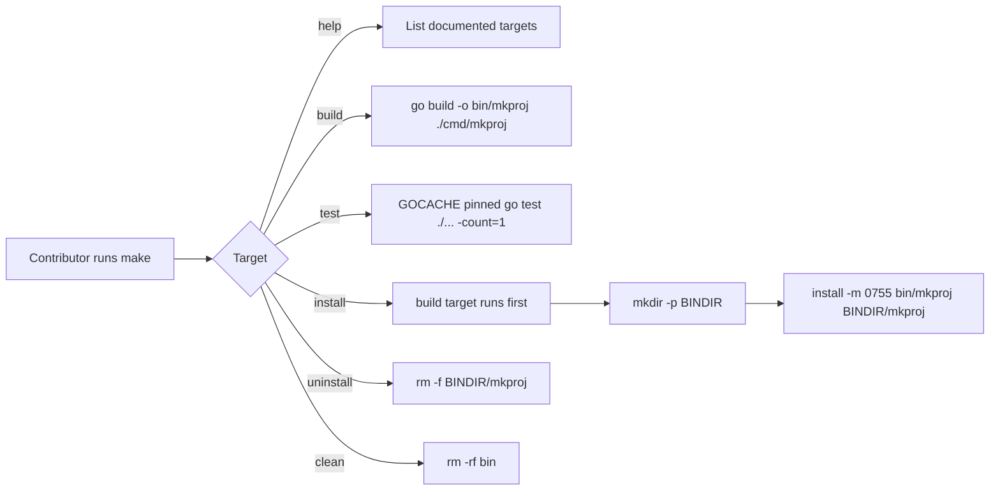

# mkproj Make Install Implementation Plan

> **For agentic workers:** REQUIRED SUB-SKILL: Use superpowers:subagent-driven-development (recommended) or superpowers:executing-plans to implement this plan task-by-task. Steps use checkbox (`- [ ]`) syntax for tracking.

**Goal:** Add a repo-root `Makefile` so contributors can build, test, install, uninstall, clean, and discover `mkproj` from one consistent command surface.

**Architecture:** Keep the feature repo-local and boring: a root `Makefile` owns developer ergonomics, while focused Go tests under `test/` pin the contract by checking exact target text and exercising the non-recursive targets. The `test` target itself is verified statically in Go and then exercised once from the shell after implementation so we do not recurse `go test ./...` from inside `go test ./...`.

**Tech Stack:** GNU Make, Go 1.24, the standard Go `testing` package, the existing `test` package helpers, repo-root `.gitignore`, and contributor docs in `README.md`

## Global Constraints

- Implementation MUST NOT start until the pending spec review for `docs/superpowers/specs/2026-06-24-mkproj-make-install-design.md` is complete.
- Reuse Beads issue `agentic_template_start-0ic`; do not create a duplicate feature issue for this slice.
- `make install` MUST build the host-platform binary and place it in `$HOME/.local/bin` by default.
- `BINDIR ?= $(HOME)/.local/bin` MUST remain overridable from the command line.
- The root `Makefile` MUST expose exactly these public targets: `help`, `build`, `test`, `install`, `uninstall`, and `clean`.
- The `test` target MUST run `GOCACHE=$(PWD)/.cache/go-build go test ./... -count=1`.
- Shell completions MUST remain out of scope.
- Version or `ldflags` embedding MUST remain out of scope.
- `cobra` migration MUST remain out of scope.
- Cross-compilation MUST remain out of scope.
- `bin/` MUST be gitignored.
- Contributor docs MUST match the actual command surface shipped in the `Makefile`.



## File Map

- Create: `Makefile`
  Responsibility: own the maintainer-facing build, test, install, uninstall, clean, and help workflow for the `mkproj` binary.
- Create: `test/makefile_test.go`
  Responsibility: pin the Make contract with static content assertions plus non-recursive shell execution of `make`, `make build`, `make install`, `make uninstall`, and `make clean`.
- Modify: `.gitignore`
  Responsibility: ignore the repo-local `bin/` build output directory.
- Modify: `README.md`
  Responsibility: document the new `make`-based install and maintenance workflow in the contributor-facing instructions.

### Task 1: Add the core Makefile contract and focused test coverage

**Files:**
- Create: `Makefile`
- Create: `test/makefile_test.go`

**Interfaces:**
- Consumes: `repoRoot(t *testing.T) string` from the existing `test` package helper in `test/golden_assets_test.go`
- Produces: `runMake(t *testing.T, dir string, args ...string) (string, error)`, `TestMakefileDefinesCoreTargets(t *testing.T)`, `TestMakeDefaultTargetShowsHelp(t *testing.T)`, `TestMakeBuildProducesMkprojBinary(t *testing.T)`, and the root `help`, `build`, `test`, and `clean` targets

- [ ] **Step 1: Write the failing Makefile contract tests**

Create `test/makefile_test.go` with this content:

```go
package test

import (
	"os"
	"os/exec"
	"path/filepath"
	"strings"
	"testing"
)

func TestMakefileDefinesCoreTargets(t *testing.T) {
	t.Parallel()

	repoRoot := repoRoot(t)
	data, err := os.ReadFile(filepath.Join(repoRoot, "Makefile"))
	if err != nil {
		t.Fatalf("ReadFile(Makefile) error = %v", err)
	}

	text := string(data)
	for _, snippet := range []string{
		".DEFAULT_GOAL := help",
		".PHONY: help build test clean",
		"help: ## Show available targets",
		"build: ## Build the mkproj binary into bin/",
		"\tgo build -o $(BIN_PATH) ./cmd/mkproj",
		"test: ## Run the full Go test suite",
		"\tGOCACHE=$(PWD)/.cache/go-build go test ./... -count=1",
		"clean: ## Remove local build outputs",
		"\trm -rf $(BIN_DIR)",
	} {
		if !strings.Contains(text, snippet) {
			t.Fatalf("Makefile missing %q\n%s", snippet, text)
		}
	}
}

func TestMakeDefaultTargetShowsHelp(t *testing.T) {
	t.Parallel()

	repoRoot := repoRoot(t)
	output, err := runMake(t, repoRoot)
	if err != nil {
		t.Fatalf("make error = %v\n%s", err, output)
	}

	for _, snippet := range []string{"help", "build", "test", "clean"} {
		if !strings.Contains(output, snippet) {
			t.Fatalf("make output missing %q\n%s", snippet, output)
		}
	}
}

func TestMakeBuildProducesMkprojBinary(t *testing.T) {
	t.Parallel()

	repoRoot := repoRoot(t)
	if output, err := runMake(t, repoRoot, "clean"); err != nil {
		t.Fatalf("make clean error = %v\n%s", err, output)
	}
	if output, err := runMake(t, repoRoot, "build"); err != nil {
		t.Fatalf("make build error = %v\n%s", err, output)
	}
	defer func() {
		if output, err := runMake(t, repoRoot, "clean"); err != nil {
			t.Fatalf("deferred make clean error = %v\n%s", err, output)
		}
	}()

	info, err := os.Stat(filepath.Join(repoRoot, "bin", "mkproj"))
	if err != nil {
		t.Fatalf("Stat(bin/mkproj) error = %v", err)
	}
	if info.IsDir() {
		t.Fatal("bin/mkproj is a directory, want file")
	}
	if info.Mode()&0o111 == 0 {
		t.Fatalf("bin/mkproj mode = %v, want executable bit", info.Mode())
	}
}

func runMake(t *testing.T, dir string, args ...string) (string, error) {
	t.Helper()

	if _, err := exec.LookPath("make"); err != nil {
		t.Skipf("make not available: %v", err)
	}

	cmd := exec.Command("make", args...)
	cmd.Dir = dir
	output, err := cmd.CombinedOutput()
	return string(output), err
}
```

- [ ] **Step 2: Run the focused tests to confirm the red state**

Run:

```bash
GOCACHE=$PWD/.cache/go-build go test ./test -run 'TestMakefileDefinesCoreTargets|TestMakeDefaultTargetShowsHelp|TestMakeBuildProducesMkprojBinary' -count=1
```

Expected: FAIL with `ReadFile(Makefile)` or `make: *** No rule to make target` because the root `Makefile` does not exist yet.

- [ ] **Step 3: Write the minimal root Makefile for the core targets**

Create `Makefile` with this content:

```make
BINARY := mkproj
BIN_DIR := bin
BIN_PATH := $(BIN_DIR)/$(BINARY)

.DEFAULT_GOAL := help

.PHONY: help build test clean

help: ## Show available targets
	@awk 'BEGIN {FS = ": ## "}; /^[a-zA-Z0-9_-]+: ## / {printf "%-12s %s\n", $$1, $$2}' $(MAKEFILE_LIST)

build: ## Build the mkproj binary into bin/
	@mkdir -p $(BIN_DIR)
	go build -o $(BIN_PATH) ./cmd/mkproj

test: ## Run the full Go test suite
	GOCACHE=$(PWD)/.cache/go-build go test ./... -count=1

clean: ## Remove local build outputs
	rm -rf $(BIN_DIR)
```

- [ ] **Step 4: Run focused verification for the core target surface**

Run:

```bash
GOCACHE=$PWD/.cache/go-build go test ./test -run 'TestMakefileDefinesCoreTargets|TestMakeDefaultTargetShowsHelp|TestMakeBuildProducesMkprojBinary' -count=1
```

Expected: PASS

Run:

```bash
make
```

Expected: PASS and print a target list that includes `help`, `build`, `test`, and `clean`

Run:

```bash
make build
```

Expected: PASS and create `bin/mkproj`

Run:

```bash
make clean
```

Expected: PASS and remove `bin/`

- [ ] **Step 5: Commit the core Makefile slice**

Run:

```bash
git add Makefile test/makefile_test.go
git commit -m "build: add core makefile targets" -m "Co-Authored-By: Peter O'Connor <poconnor@stackoverflow.com>\nCo-Authored-By: Codex <noreply@anthropic.com> - GPT-5"
```

### Task 2: Extend the install lifecycle and ignore local build output

**Files:**
- Modify: `Makefile`
- Modify: `test/makefile_test.go`
- Modify: `.gitignore`

**Interfaces:**
- Consumes: `runMake(t *testing.T, dir string, args ...string) (string, error)` from Task 1 and the `build` target already created in `Makefile`
- Produces: `TestMakefileDefinesInstallLifecycleTargets(t *testing.T)`, `TestMakeInstallAndUninstallRoundTrip(t *testing.T)`, `TestGitIgnoreIgnoresBinDirectory(t *testing.T)`, plus the public `install` and `uninstall` targets

- [ ] **Step 1: Add failing tests for install, uninstall, and gitignore behavior**

Update `test/makefile_test.go` by adding the `errors` import and these test functions:

```go
import (
	"errors"
	"os"
	"os/exec"
	"path/filepath"
	"strings"
	"testing"
)

func TestMakefileDefinesInstallLifecycleTargets(t *testing.T) {
	t.Parallel()

	repoRoot := repoRoot(t)
	data, err := os.ReadFile(filepath.Join(repoRoot, "Makefile"))
	if err != nil {
		t.Fatalf("ReadFile(Makefile) error = %v", err)
	}

	text := string(data)
	for _, snippet := range []string{
		"BINDIR ?= $(HOME)/.local/bin",
		".PHONY: help build test install uninstall clean",
		"install: build ## Install mkproj into BINDIR",
		"\t@mkdir -p $(BINDIR)",
		"\tinstall -m 0755 $(BIN_PATH) $(BINDIR)/mkproj",
		"uninstall: ## Remove installed mkproj from BINDIR",
		"\trm -f $(BINDIR)/mkproj",
	} {
		if !strings.Contains(text, snippet) {
			t.Fatalf("Makefile missing %q\n%s", snippet, text)
		}
	}
}

func TestMakeInstallAndUninstallRoundTrip(t *testing.T) {
	t.Parallel()

	repoRoot := repoRoot(t)
	bindir := filepath.Join(repoRoot, ".cache", "mkproj-bin")
	installedBinary := filepath.Join(bindir, "mkproj")

	if output, err := runMake(t, repoRoot, "clean"); err != nil {
		t.Fatalf("make clean error = %v\n%s", err, output)
	}
	defer func() {
		if output, err := runMake(t, repoRoot, "clean"); err != nil {
			t.Fatalf("deferred make clean error = %v\n%s", err, output)
		}
	}()

	if output, err := runMake(t, repoRoot, "install", "BINDIR="+bindir); err != nil {
		t.Fatalf("make install error = %v\n%s", err, output)
	}

	info, err := os.Stat(installedBinary)
	if err != nil {
		t.Fatalf("Stat(%s) error = %v", installedBinary, err)
	}
	if info.Mode()&0o111 == 0 {
		t.Fatalf("%s mode = %v, want executable bit", installedBinary, info.Mode())
	}

	cmd := exec.Command(installedBinary, "update")
	cmd.Dir = repoRoot
	output, err := cmd.CombinedOutput()
	if err == nil {
		t.Fatalf("%s update error = nil, want missing flag\n%s", installedBinary, output)
	}
	if !strings.Contains(string(output), "missing required flag: --stack") {
		t.Fatalf("%s update output = %q, want missing stack flag", installedBinary, string(output))
	}

	if output, err := runMake(t, repoRoot, "uninstall", "BINDIR="+bindir); err != nil {
		t.Fatalf("make uninstall error = %v\n%s", err, output)
	}
	if _, err := os.Stat(installedBinary); !errors.Is(err, os.ErrNotExist) {
		t.Fatalf("Stat(%s) error = %v, want not exists", installedBinary, err)
	}
}

func TestGitIgnoreIgnoresBinDirectory(t *testing.T) {
	t.Parallel()

	repoRoot := repoRoot(t)
	data, err := os.ReadFile(filepath.Join(repoRoot, ".gitignore"))
	if err != nil {
		t.Fatalf("ReadFile(.gitignore) error = %v", err)
	}

	text := string(data)
	if !strings.Contains(text, "\nbin/\n") && !strings.HasPrefix(text, "bin/\n") {
		t.Fatalf(".gitignore missing bin/ entry\n%s", text)
	}
}
```

- [ ] **Step 2: Run the focused tests to confirm the install lifecycle is still missing**

Run:

```bash
GOCACHE=$PWD/.cache/go-build go test ./test -run 'TestMakefileDefinesInstallLifecycleTargets|TestMakeInstallAndUninstallRoundTrip|TestGitIgnoreIgnoresBinDirectory' -count=1
```

Expected: FAIL because `Makefile` does not yet define `BINDIR`, `install`, or `uninstall`, and `.gitignore` does not yet ignore `bin/`.

- [ ] **Step 3: Extend the Makefile and ignore `bin/`**

Replace `Makefile` with this content:

```make
BINARY := mkproj
BIN_DIR := bin
BIN_PATH := $(BIN_DIR)/$(BINARY)
BINDIR ?= $(HOME)/.local/bin

.DEFAULT_GOAL := help

.PHONY: help build test install uninstall clean

help: ## Show available targets
	@awk 'BEGIN {FS = ": ## "}; /^[a-zA-Z0-9_-]+: ## / {printf "%-12s %s\n", $$1, $$2}' $(MAKEFILE_LIST)

build: ## Build the mkproj binary into bin/
	@mkdir -p $(BIN_DIR)
	go build -o $(BIN_PATH) ./cmd/mkproj

test: ## Run the full Go test suite
	GOCACHE=$(PWD)/.cache/go-build go test ./... -count=1

install: build ## Install mkproj into BINDIR
	@mkdir -p $(BINDIR)
	install -m 0755 $(BIN_PATH) $(BINDIR)/mkproj

uninstall: ## Remove installed mkproj from BINDIR
	rm -f $(BINDIR)/mkproj

clean: ## Remove local build outputs
	rm -rf $(BIN_DIR)
```

Add this line to `.gitignore` near the other local build artifacts:

```gitignore
bin/
```

- [ ] **Step 4: Run focused verification for install and uninstall**

Run:

```bash
GOCACHE=$PWD/.cache/go-build go test ./test -run 'TestMakefileDefinesInstallLifecycleTargets|TestMakeInstallAndUninstallRoundTrip|TestGitIgnoreIgnoresBinDirectory' -count=1
```

Expected: PASS

Run:

```bash
make
```

Expected: PASS and print a target list that includes `help`, `build`, `test`, `install`, `uninstall`, and `clean`

Run:

```bash
make install BINDIR=$PWD/.cache/mkproj-bin
```

Expected: PASS and create `.cache/mkproj-bin/mkproj`

Run:

```bash
PATH=$PWD/.cache/mkproj-bin:$PATH command -v mkproj
```

Expected: PASS and print the repo-local install path inside `.cache/mkproj-bin`

Run:

```bash
./.cache/mkproj-bin/mkproj update
```

Expected: FAIL with `missing required flag: --stack`, which proves the installed binary runs

Run:

```bash
make uninstall BINDIR=$PWD/.cache/mkproj-bin
```

Expected: PASS and remove `.cache/mkproj-bin/mkproj`

Run:

```bash
make clean
```

Expected: PASS and remove `bin/`

- [ ] **Step 5: Commit the install lifecycle slice**

Run:

```bash
git add Makefile .gitignore test/makefile_test.go
git commit -m "build: add make install lifecycle" -m "Co-Authored-By: Peter O'Connor <poconnor@stackoverflow.com>\nCo-Authored-By: Codex <noreply@anthropic.com> - GPT-5"
```

### Task 3: Align the contributor docs with the shipped `make` workflow

**Files:**
- Modify: `README.md`
- Modify: `test/makefile_test.go`

**Interfaces:**
- Consumes: the final public target surface from Task 2 and the existing `Build The CLI` plus `Common Development Commands` sections in `README.md`
- Produces: `TestReadmeDocumentsMakeWorkflow(t *testing.T)` and contributor-facing documentation for `make install`, `make build`, `make test`, `make clean`, and `make uninstall`

- [ ] **Step 1: Add a failing README documentation contract test**

Append this test to `test/makefile_test.go`:

```go
func TestReadmeDocumentsMakeWorkflow(t *testing.T) {
	t.Parallel()

	repoRoot := repoRoot(t)
	data, err := os.ReadFile(filepath.Join(repoRoot, "README.md"))
	if err != nil {
		t.Fatalf("ReadFile(README.md) error = %v", err)
	}

	text := string(data)
	for _, snippet := range []string{
		"make install",
		"make install BINDIR=/custom/bin",
		"make build",
		"make test",
		"make clean",
		"make uninstall",
	} {
		if !strings.Contains(text, snippet) {
			t.Fatalf("README.md missing %q\n%s", snippet, text)
		}
	}
}
```

- [ ] **Step 2: Run the focused test to capture the current README gap**

Run:

```bash
GOCACHE=$PWD/.cache/go-build go test ./test -run TestReadmeDocumentsMakeWorkflow -count=1
```

Expected: FAIL because `README.md` still documents `go build ./cmd/mkproj` and does not yet describe the `make` workflow.

- [ ] **Step 3: Update the README sections that teach local usage**

Replace the `Build The CLI` section in `README.md` with this content:

````markdown
### Install The CLI

For the normal local developer install path:

```bash
make install
```

Override the destination directory when you do not want to write to `$HOME/.local/bin`:

```bash
make install BINDIR=/custom/bin
```

### Build The CLI

For a repo-local binary without installing it:

```bash
make build
```

Run the full verification suite through the same command surface:

```bash
make test
```

Remove the repo-local build output:

```bash
make clean
```

Remove the installed binary from the selected install directory:

```bash
make uninstall
```

For one-off runs during development without writing `bin/mkproj`:

```bash
go run ./cmd/mkproj
```
````

Update the `Common Development Commands` section in `README.md` so it includes this block:

````markdown
```bash
make build
make test
make clean
GOCACHE=$PWD/.cache/go-build go test ./... -count=1
```
````

- [ ] **Step 4: Run focused documentation verification and the full suite once**

Run:

```bash
GOCACHE=$PWD/.cache/go-build go test ./test -run TestReadmeDocumentsMakeWorkflow -count=1
```

Expected: PASS

Run:

```bash
make test
```

Expected: PASS

- [ ] **Step 5: Commit the docs alignment slice**

Run:

```bash
git add README.md test/makefile_test.go
git commit -m "docs: add make workflow guidance" -m "Co-Authored-By: Peter O'Connor <poconnor@stackoverflow.com>\nCo-Authored-By: Codex <noreply@anthropic.com> - GPT-5"
```
