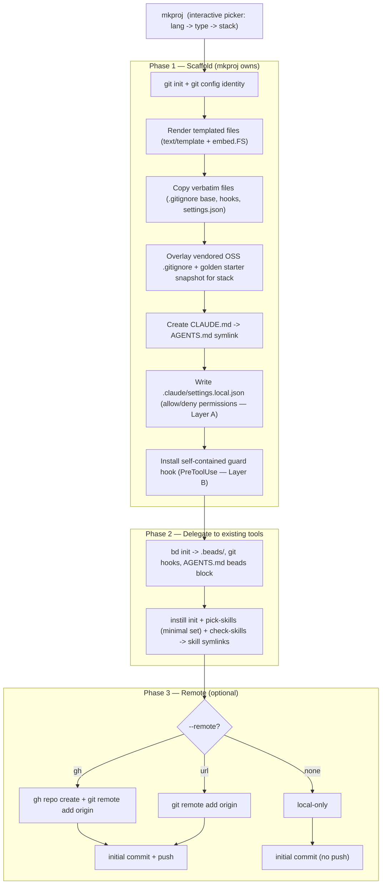
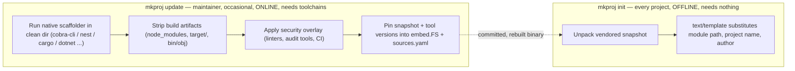
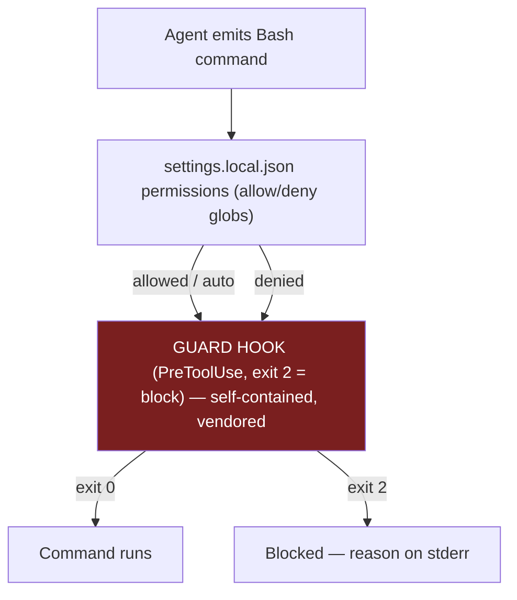

# mkproj — Reusable Git Project Initialization Template System

**Status:** Design approved (brainstorming complete) · **Date:** 2026-06-16
**Author:** Peter O'Connor with Claude Code (databricks-claude-opus-4-8)

---

## 1. Problem & Goal

Every new project begins with 10–15 minutes of identical manual setup: `git init`,
copy a known-good Claude/beads config from a prior project, prune unwanted skills,
re-add starter skills, link the agents file via a Claude `.md` symlink, and install +
configure beads with a known-good `settings.local.json`. This is pure, repeatable
overhead.

**Goal:** one command → a fully initialized project, indistinguishable from what the
author would have built by hand, with **zero** follow-up configuration.

**Verification test:** run the init command in an empty folder; the result must be
indistinguishable from a hand-built project — no manual steps after.

### Terminology reconciliation

The original brief used exploratory names. They map to concrete artifacts in this repo:

| Brief term | Actual artifact |
|---|---|
| "Beats" / "BSRC" | **beads** (`bd`) — issue tracker |
| "agents file linked to a Claude `.md`" | `CLAUDE.md` → `AGENTS.md` symlink |
| "`.local.json` with known-good defaults" | `.claude/settings.local.json` `permissions` block |
| skill prune/re-add workflow | **`instill`** CLI (`init`, `pick-skills`, `check-skills`) |

A key early finding: **`instill` and `bd` already perform most of the scaffolding work.**
`mkproj` therefore orchestrates them rather than reimplementing them.

---

## 2. Engine & Distribution Decisions

| Decision | Choice | Rationale |
|---|---|---|
| Scaffolding engine | **Standalone Go binary** using `text/template` + `embed.FS` | Self-contained, single tool owns templating end-to-end; sibling to existing `gw`/`instill` tools. |
| Distribution | **Installed binary** (`~/.local/bin/mkproj`), templates embedded | No clone, no machine-path dependency; works in any empty dir. |
| Template/asset sourcing | **Vendored + refreshable** | Init is fully **offline** and **reproducible**; `mkproj update` re-fetches and re-pins upstreams under maintainer control. |
| Selection UX | **Interactive picker** (language → type → stack), flags may pre-answer prompts | Simple mental model; flags preserved so automation stays possible. |
| Deny-list enforcement | **Both** `settings.local.json` permissions **and** a self-contained PreToolUse guard hook | Defense in depth. |

**Explicitly rejected:** a from-scratch templating engine (reinvents `bd`/`instill`);
pure shell `init.sh` (weaker templating/validation); Cookiecutter/Copier as the engine
(adds a Python runtime dependency and a second templating syntax — kept only as
acknowledged prior art we deliberately do not depend on).

---

## 3. System Architecture

`mkproj` runs init in three ordered phases. It **owns** templating, verbatim copy,
symlink creation, permissions, and guard-hook installation; it **delegates** to `bd`
and `instill` for what they already do well.



**Phase-ordering note:** the guard hook installs **before** `bd init` so that beads'
own git-hook installation runs under the guard, not the reverse.

### `mkproj update` (maintainer path)

Keeps init offline/reproducible while allowing controlled refresh: re-fetches vendored
`.gitignore` files and regenerates golden snapshots from native scaffolders, then
re-pins them into the source tree (followed by a rebuild).

---

## 4. Template Catalog — the "Golden Snapshot" Model

Scope is a **language × project-type matrix**. Each golden template is a **pinned
snapshot of an ecosystem-native scaffolder's output**, not a live invocation at init.

| Stack key | Lang | Type | Native scaffolder captured |
|---|---|---|---|
| `go-cli-cobra` | Go | CLI | `cobra-cli init` + `add serve/config` |
| `go-api-chi` | Go | API | `golang-standards/project-layout` + chi/zap/viper/testify |
| `ts-cli-commander-tsup` | TS | CLI | `commander` + `tsup` |
| `nestjs-api` | TS | API | `nest new` |
| `react-vite-ts` | TS | Frontend | `npm create vite` (React + TS) |
| `angular-standard` | TS | Frontend | `ng new` |
| `rust-cli-clap` | Rust | CLI | `cargo new` + `clap`/`anyhow` |
| `rust-api-axum` | Rust | API | `cargo new` + axum/tokio/serde/sqlx |
| `python-cli-typer` | Python | CLI | `uv add typer` |
| `python-fastapi` | Python | API | `uv init` + fastapi/uvicorn |
| `csharp-cli` | C# | CLI | `dotnet new console` + System.CommandLine |
| `csharp-webapi` | C# | API | `dotnet new webapi` |
| `bash-utility` | Bash | Util | shellcheck/shfmt/bats layout |



Native scaffolders (`cobra-cli`, `nest`, `cargo`, .NET SDK, …) are required only on the
**maintainer** path, never at init.

`.gitignore` per language is sourced from the canonical **`github/gitignore`** repo,
merged with this repo's existing multi-language base `.gitignore`.

---

## 5. Template Variables

Collected via interactive prompts (flags may pre-answer). Everything else is verbatim.

- **Project name** — directory, bd issue prefix, module/repo path, `AGENTS.md` header.
- **Primary language/stack** — selects golden snapshot, `.gitignore` section, starter
  skill set, and test command.
- **Author identity** — name + email for `git config` and the `Co-Authored-By` footer
  (defaults from global config).
- **Git remote** — `none` | explicit URL | **`gh`** (create remote via `gh repo create`).

---

## 6. Allow/Deny Ruleset for Auto Mode

**Invariant — the guard hook is the terminal authority.** On every Bash tool call:



Auto mode bypasses the **confirmation prompt** but **never** the hook: Claude Code runs
PreToolUse hooks in every permission mode, and a hook `exit 2` blocks the call. The
guard is genuinely the floor.

### Layer A — `settings.local.json` permissions (declarative, coarse)

```json
{
  "permissions": {
    "allow": [
      "Bash(bd*)", "Bash(instill*)",
      "Bash(git add*)", "Bash(git commit*)", "Bash(git push*)",
      "Bash(git pull*)", "Bash(git checkout*)", "Bash(git branch*)",
      "Bash(git status*)", "Bash(git diff*)", "Bash(git log*)"
    ],
    "ask": [],
    "deny": [
      "Bash(rm -rf*)", "Bash(git rm -rf*)",
      "Bash(*--force*)", "Bash(git push --force*)",
      "Bash(*DROP DATABASE*)", "Bash(*dropdb*)"
    ]
  }
}
```

### Layer B — guard hook rule table (authoritative, constituent-aware)

The hook reads the JSON payload, splits compound commands on `&&`, `||`, `;`, and pipes,
judges **each** constituent, and **allows only if every constituent is allowed** (a
single denied constituent blocks the whole line). Blocks with a clear stderr reason.

| # | Rule | Decision | Notes |
|---|---|---|---|
| A1 | `bd …`, `instill …` | allow | All BSRC/beads commands by default |
| A2 | `git add/commit/push/pull/checkout/branch/status/diff/log/fetch/merge/rebase/stash` | allow | Except deny carve-outs below |
| A3 | File reads/writes (`cat`, `ls`, `mkdir`, `touch`, `cp`, `mv`, single-file `rm -f`) | allow | Standard file ops |
| A4 | Compound `a && b && c` | allow **iff** every constituent allowed | One denied constituent blocks the line |
| D1 | `rm -rf` / `rm -r` recursive force delete (any flag order) | **block** | Destructive recursive delete |
| D2 | `git rm -rf` / mass cached removal | **block** | |
| D3 | `git push --force`/`-f` to a **protected branch** | **block** | `--force-with-lease` to non-protected branch allowed |
| D4 | Any history-rewriting push targeting a protected branch | **block** | Protected: `main master develop release/* production` |
| D5 | `DROP DATABASE`/`DROP SCHEMA`/`dropdb`/`TRUNCATE` (no WHERE) | **block** | Dropping databases |
| D6 | `mkfs*`, `dd of=/dev/*`, `> /dev/sd*`, fork bombs, `chmod -R 777 /` | **block** | Catch-all irreversible device/fs ops |
| D7 | `git reset --hard` / `git clean -fdx` / `git checkout .` discarding uncommitted work | **block** | Irreversible local data loss |
| D8 | `git commit --no-verify`/`-n`, `--no-gpg-sign` | **block** | Never bypass commit hooks (carries forward the one useful `calm-git-guard` behavior, now self-contained) |

**Default posture:** commands matching neither an explicit allow nor deny rule **run**
(deny-list is the safety net, not an allowlist jail) — matching the constraint "allow by
default, block the irreversible."

**Self-containment:** the hook ships inside the project (`.claude/hooks/guard`) and is
wired with a **project-relative** command — never an absolute machine path. The
protected-branch list is a configurable array at the top of the hook.

---

## 7. File Manifest — the `mkproj` source repo

Roles: **[embed]** compiled in · **[render]** templated at init · **[verbatim]** copied
as-is · **[link]** symlinked · **[delegate]** produced by `bd`/`instill`/native tooling.

```
mkproj/
├── cmd/mkproj/main.go              # CLI entrypoint: `init` (default) + `update`
├── internal/
│   ├── scaffold/                   # Phase 1: render, copy, symlink, settings, guard
│   ├── delegate/                   # Phase 2: shell out to bd + instill
│   ├── remote/                     # Phase 3: gh repo create / git remote add
│   ├── prompt/                     # interactive picker (language -> type -> stack)
│   └── catalog/                    # stack-key matrix + resolution
├── sources.yaml                    # [maintainer] pinned upstreams (repo, path, ref/SHA)
├── templates/                      # ── all embed.FS ──
│   ├── common/
│   │   ├── gitignore.base          # [verbatim] multi-language base .gitignore
│   │   ├── AGENTS.md.tmpl          # [render]  {{.ProjectName}} header
│   │   ├── claude/
│   │   │   ├── settings.json        # [verbatim] hooks: bd prime, instill check-skills
│   │   │   ├── settings.local.json.tmpl  # [render] allow/deny permissions (Layer A)
│   │   │   └── hooks/guard           # [verbatim] self-contained guard hook (Layer B)
│   │   ├── codex/hooks.json          # [verbatim] codex SessionStart: bd prime
│   │   └── skill-manifest.json.tmpl # [render]  minimal starter skill set per stack
│   ├── gitignore/                  # [embed] vendored github/gitignore per lang
│   └── golden/                     # [embed] pinned native-scaffolder snapshots
│       ├── go-cli-cobra/  go-api-chi/  ts-cli-commander-tsup/  nestjs-api/
│       ├── react-vite-ts/  angular-standard/  rust-cli-clap/  rust-api-axum/
│       ├── python-cli-typer/  python-fastapi/  csharp-cli/  csharp-webapi/  bash-utility/
│       └── <each>/.mkproj-overlay/  # security overlay: linters, audit, CI
└── docs/superpowers/specs/         # this design doc
```

### Output in a scaffolded project (what the verification test inspects)

```
myproject/
├── .git/                    [delegate] git init + identity
├── .gitignore               base + vendored lang gitignore, merged
├── AGENTS.md                rendered, + bd's injected beads block
├── CLAUDE.md -> AGENTS.md    [link] exact symlink pattern preserved
├── .claude/{settings.json, settings.local.json, hooks/guard, skill-manifest.json, skills/->}
├── .codex/hooks.json
├── .beads/                  [delegate] bd init
└── <golden template files>  rendered: module path, project name, author substituted
```

---

## 8. Open Items for Implementation Planning

- Minimal starter **skill set per stack** (which `instill` skills are defaults).
- Security overlay contents per ecosystem (linters, audit tools, CI workflow files).
- Exact `text/template` variable schema and prompt sequence.
- `mkproj update` snapshot-capture automation (which toolchains, version pinning).

---

*Authored By Peter O'Connor with Assistance from Claude Code (databricks-claude-opus-4-8) · 2026-06-16 · mkproj scaffolding system design*
