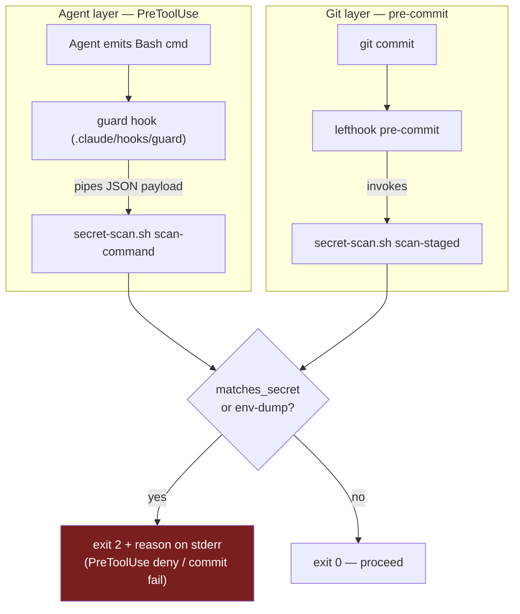

# Shared secret-scan script (bd: agentic_template_start-79r)

**Status:** decided 2026-06-18 (brainstorming) · **Author:** Peter O'Connor with Claude Code (databricks-claude-opus-4-8)

The single secret-scan script invoked by **both** the PreToolUse agent guard hook and
lefthook pre-commit, per the layer-composition decision in
[ADR-0003](../../adr/0003-enforced-opinions-via-shared-gate-pipeline.md). It implements the
secret-scan slice of the deny floor defined in the
[allowlist + deny-floor seed](2026-06-18-allowlist-deny-floor-seed.md) — seed rules **D9**
(secret path-token scan) and **D10** (env-dump verbs) — and nothing else.

---

## 1. Scope & boundary

This script is the **secret-scan slice of the deny floor only**. It is explicitly **not**
the full guard hook: seed rules D1–D8 and D11–D16 are separate, unfiled work. The future
`.claude/hooks/guard` will *compose* this script; lefthook pre-commit *also* calls it. One
canonical pattern list, one matcher, two callers — exactly the "one shared script" that
ADR-0003's layer-composition decision requires.

It honors `CONTEXT.md`'s two-distinct-jobs framing (secret-exposure guard vs. content
secret-scan) under one roof, expressed as two modes over a shared core:

| Mode | Caller | Input | Blocks |
|---|---|---|---|
| `scan-command` | agent guard (PreToolUse) | command line (JSON payload on stdin, or `--command`) | D9 path-token references + D10 env-dump verbs |
| `scan-staged` | lefthook pre-commit | `git diff --cached --name-only` | staged files whose **path** matches a secret pattern |

**Shared core:** one `SECRET_PATTERNS` array (configurable, at top of file), one
`EXEMPT_PATTERNS` carve-out, and one matcher function used by both modes.

**Block contract:** `exit 2` + reason on stderr (works for both PreToolUse deny and
lefthook fail); clean = `exit 0`; bad invocation = `exit 64` (EX_USAGE).

## 2. Language & location

- **Language:** POSIX-friendly **bash**. Zero runtime dependency (present on every
  macOS/Linux dev machine regardless of project stack), and matches the `guardrails-bin`
  heritage the seed ports from. A Go or C# project cannot assume Python or a Go toolchain
  on the guard's hot path.
- **Location:** `.claude/hooks/secret-scan.sh` — standalone executable, self-contained,
  ships verbatim inside every scaffolded project. Matches the design's `.claude/hooks/`
  placement.

## 3. Component structure & interface

Single file, organized:

```
# ── Configuration (edit here) ───────────────────────────
SECRET_PATTERNS=( .env .env.* *.pem *.key id_rsa* id_ed25519*
                  credentials *secret* *.tfstate .ssh/ .aws/ .gnupg/ )
EXEMPT_PATTERNS=( *.example *.sample *.template )      # checked first
ENV_DUMP_VERBS=( env printenv set export declare typeset compgen )

# ── Core (shared by both modes) ─────────────────────────
is_exempt <token>        → 0 if token matches an EXEMPT pattern
matches_secret <token>   → 0 if token matches a SECRET pattern (and not exempt)

# ── Modes ───────────────────────────────────────────────
scan_command  → read line (stdin JSON .tool_input.command, or --command)
                D9: tokenize line, block if any token matches_secret
                D10: block if line is a bare env-dump verb (no filtering pipe)
scan_staged   → for f in $(git diff --cached --name-only):
                block if matches_secret "$f"

# ── Dispatch ────────────────────────────────────────────
case "$1" in scan-command|scan-staged) … ; *) usage; exit 64 ;; esac
```

**Caller-facing contract (the only seam):**
- `secret-scan.sh scan-command` — reads guard JSON from stdin (falls back to
  `--command "<line>"` for direct testing). `exit 2` + stderr reason on block; `0` clean.
- `secret-scan.sh scan-staged` — reads staged files from git. `exit 2` + stderr list on
  block; `0` clean.
- The two callers never touch internals — they call a subcommand and read an exit code.

**Two deliberate constraints, carried from the seed / ADR-0002:**
- **D9 is a path-*token* scan, not a command-name list.** It blocks the secret path
  regardless of binary (`cat`, `awk`, `python -c`, `git show HEAD:.env`, `tar -O`). A name
  list is trivially bypassed and is explicitly rejected by ADR-0002.
- **Documented irreducible gaps** stay documented, not pretended-closed (a comment block in
  the script names them): obfuscated paths inside interpreter one-liners
  (`python3 -c 'open("."+"env")'`), raw `git cat-file -p <sha>` / `git stash show -p` (no
  path token). The OS sandbox (seed §5) is the backstop.

## 4. Data flow & wiring



**What 79r lands in this repo:**
1. `.claude/hooks/secret-scan.sh` — the script (the deliverable).
2. `lefthook.yml` — a `pre-commit` job calling `.claude/hooks/secret-scan.sh scan-staged`.
   This is the first lefthook config in the repo; kept **minimal** (secret-scan job only)
   so it does not pre-empt the `mise`-task gate wiring that issue **x2k** owns. A header
   comment notes lint/format/test jobs arrive with x2k, which **extends** this file.
3. The **guard hook itself is NOT created here** (separate unfiled work). The exact one-line
   call the future guard uses (`.claude/hooks/secret-scan.sh scan-command`) is documented in
   a script comment and in this spec, so the guard issue just composes it.

**Error handling:**
- Missing/empty stdin in `scan-command` → empty command → `exit 0` (never crash the agent).
- Not in a git repo / no staged files in `scan-staged` → `exit 0`.
- `set -euo pipefail`; matcher loops tolerate empty arrays.
- Reason strings name the offending token and the rule, e.g.
  `BLOCKED [D9]: command references secret path '.env'`.

**Carve-out:** `*.example`, `*.sample`, `*.template` are checked before secret matching so
the near-universal convention of reading/editing/committing `.env.example` does not produce
day-one friction.

## 5. Testing (bats-core, red-green-refactor)

`bats-core` is added via `mise.toml` (`[tools] bats = "latest"`), seeding the
`mise`-as-bootstrap pattern x2k builds on. Tests live at `test/secret-scan.bats`. Each
failing test is written first, then the code to pass it.

**`scan-command` — D9 path-token blocks (exit 2):** `cat .env`; `awk '1' config/.env`;
`git show HEAD:.env`; `python3 -c "open('x')"` referencing `secrets.tfstate`; `cat app.pem`;
compound `git status && cat .env` (token anywhere in line).

**`scan-command` — D10 env dumps:** bare `env` blocked; `printenv` blocked; `set` blocked;
`env | grep -v SECRET` (filtered) **allowed**.

**`scan-command` — clean / carve-out (exit 0):** `cat README.md`; `ls -la`; `cat .env.example`;
`vim .env.template`; empty stdin (exit 0, no crash).

**`scan-staged` (exit 2):** staged `.env` blocked; staged `server.key` blocked; staged
`.env.example` allowed; staged `README.md` allowed; no staged files / not a git repo allowed.

**Usage:** bad subcommand → exit 64.

Full suite plus a real-staged-secret lefthook check run before claiming done
(verification-before-completion).

## 6. Deliverables

- `.claude/hooks/secret-scan.sh`
- `lefthook.yml` (secret-scan pre-commit job only)
- `mise.toml` (`[tools] bats`)
- `test/secret-scan.bats`
- this design spec

---

*Authored By Peter O'Connor with Assistance from Claude Code (databricks-claude-opus-4-8) · 2026-06-18 · shared secret-scan script (79r)*
