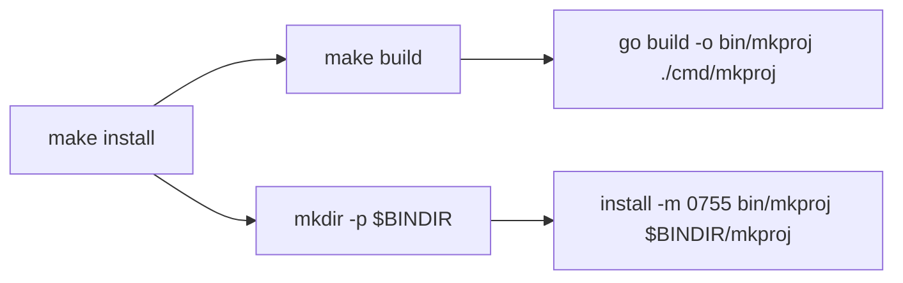

# mkproj Make System — Design

- **Beads issue:** agentic_template_start-0ic
- **Date:** 2026-06-24
- **Status:** Approved (pending spec review)

## Problem

`mkproj` has no Makefile. Building and installing the CLI is a manual
`go build` plus a hand copy. A contributor running `make install` SHOULD get a
working `mkproj` on their PATH in one step.

## Goal

`make install` MUST build the `mkproj` binary for the host platform and place it
in `$HOME/.local/bin`, which is already on the user's PATH.

## Scope

### In scope

- A `Makefile` at the repository root with build / test / install / uninstall /
  clean / help targets.
- Placing the binary in `$HOME/.local/bin` (overridable via `BINDIR`).
- Ensuring the local build output directory `bin/` is gitignored.

### Out of scope (explicitly deferred)

- **Shell completions.** The CLI uses Go's stdlib `flag` package, which emits no
  completions. Deciding the completion source (a `completion` subcommand, static
  files, or a cobra migration) is deferred. No completion targets are added.
- **Version/ldflags embedding.** There are no git tags yet; no version injection.
- **cobra migration.** The command surface stays on stdlib `flag`.
- **Cross-compilation.** Host platform only (YAGNI).

## Targets

| Target | Behavior |
|--------|----------|
| `help` (default) | Self-documenting list of targets. Runs when `make` is called with no arguments. |
| `build` | `go build -o bin/mkproj ./cmd/mkproj`. Produces the host binary in `bin/`. |
| `test` | `GOCACHE=$(PWD)/.cache/go-build go test ./... -count=1`. Matches the project's documented verification command. |
| `install` | Depends on `build`. Creates `$(BINDIR)` if absent, then `install -m 0755 bin/mkproj $(BINDIR)/mkproj`. |
| `uninstall` | Removes `$(BINDIR)/mkproj`. |
| `clean` | Removes `bin/`. |

## Key decisions

- **`BINDIR ?= $(HOME)/.local/bin`** — fixed default per the user's choice, but
  `?=` leaves an override escape hatch (`make install BINDIR=/somewhere`) at no
  added complexity.
- **`install(1)` over `cp`** — sets the `0755` mode atomically; standard for
  installing executables.
- **`install` depends on `build`** — a single `make install` always builds fresh.
- **All targets `.PHONY`** — none of the target names correspond to on-disk files
  (build output lives under `bin/`).
- **`bin/` added to `.gitignore`** — it is not currently ignored.

## Data flow

## Verification

1. `make build` → `bin/mkproj` exists and is executable.
2. `make install` → `$HOME/.local/bin/mkproj` exists; `which mkproj` resolves
   there; `mkproj` runs.
3. `make test` → full Go suite passes.
4. `make clean` → `bin/` removed.
5. `make uninstall` → installed binary removed.
6. `make help` (or bare `make`) → lists targets.
7. `git status` → `bin/` not shown as untracked.

## Error handling

- Standard Make failure semantics: any failed recipe line aborts the target with
  a non-zero exit code.
- `mkdir -p` / `install -d` makes the install idempotent regardless of whether
  `$(BINDIR)` already exists.
