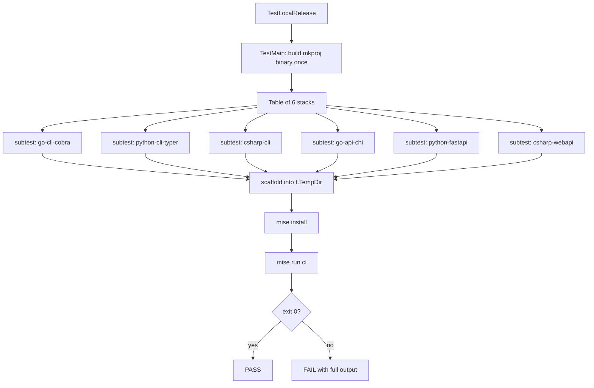

# Template Verification — Design

- **Date:** 2026-06-26
- **Status:** Draft

## Problem

Every template fix to date (PRs #28–#33) has required manual scaffolding and
multiple iterations to resolve. There is zero automated confidence that a
scaffolded project actually works. A maintainer changing `templates/golden/` or
`templates/common/` has no feedback loop shorter than "scaffold it by hand and
run the gates yourself." This is unacceptable for shipping quality.

## Goal

mkproj's own test suite MUST prove that each shipped stack produces a working
project — lint passes, tests pass, the thing runs — on every push. Failures MUST
block the branch for the foundational stacks (one CLI per language) and MUST be
surfaced async for the full matrix.

## Domain Terms (see CONTEXT.md)

| Term | Definition |
|------|-----------|
| **Local-release** | `mise run ci` exits 0 with real tools. The proof a scaffold works. |
| **Fast gate** | scaffold → install → local-release for one CLI per language. Blocks branch. |
| **Slow gate** | scaffold → install → local-release for all stacks. Async. |
| **Structural verification** | Existing tests that assert file presence/content. Complementary. |

## Scope

### In scope

- A Go integration test file (`test/local_release_test.go`) gated by
  `//go:build integration` that scaffolds real projects and runs their full
  `mise run ci` with real toolchains.
- A table-driven test covering all 6 stacks as subtests.
- A GitHub Actions workflow (`.github/workflows/verify-templates.yml`) that runs
  the fast gate on every push/PR and the slow gate on a schedule or manual
  trigger.
- A `make verify-fast` / `make verify-slow` target for local developer use.

### Out of scope (explicitly deferred)

- **Containerized/hermetic environments.** Tests run on the host (or CI runner)
  with real toolchains installed via mise. Hermetic builds are a future concern.
- **Template diffing / snapshot testing.** Structural verification already covers
  file presence. This spec is about behavioral correctness only.
- **Performance benchmarking.** We assert correctness (exit 0), not speed.
- **Generated project deployment.** Local-release means "works on this machine,"
  not "deploys to production."

## Architecture



## Test Design

### File: `test/local_release_test.go`

```go
//go:build integration

package test

// Table-driven test. Each row:
// - stack name (used as subtest name)
// - language
// - project type (cli | api)
// - stack identifier (matches templates/golden/<stack>)
//
// TestMain builds mkproj binary once, shares path via package-level var.
// Each subtest:
//   1. t.Parallel()
//   2. Create t.TempDir()
//   3. Run: mkproj init --project-name "verify-<stack>" --language <lang>
//      --project-type <type> --stack <stack> --author-name "CI" 
//      --author-email "ci@test" --remote none
//   4. Run: mise install (in scaffolded dir)
//   5. Run: mise run ci (in scaffolded dir)
//   6. Assert exit code 0; on failure, log combined stdout+stderr
```

### Stack Table

| Subtest name | Language | Type | Stack | Fast gate |
|-------------|----------|------|-------|-----------|
| `go-cli-cobra` | go | cli | go-cli-cobra | yes |
| `python-cli-typer` | python | cli | python-cli-typer | yes |
| `csharp-cli` | csharp | cli | csharp-cli | yes |
| `go-api-chi` | go | api | go-api-chi | no |
| `python-fastapi` | python | api | python-fastapi | no |
| `csharp-webapi` | csharp | api | csharp-webapi | no |

### Test Execution

**Fast gate (local):**
```bash
make verify-fast
# equivalent to:
GOCACHE=$PWD/.cache/go-build go test -tags=integration -count=1 -timeout=10m \
  -run "TestLocalRelease/(go-cli-cobra|python-cli-typer|csharp-cli)" ./test/
```

**Slow gate (local):**
```bash
make verify-slow
# equivalent to:
GOCACHE=$PWD/.cache/go-build go test -tags=integration -count=1 -timeout=20m \
  -run "TestLocalRelease" ./test/
```

### TestMain Structure

```go
var mkprojBinary string

func TestMain(m *testing.M) {
    // Build mkproj once into a temp directory
    // Set mkprojBinary to the absolute path
    // Run tests
    // Clean up
    os.Exit(m.Run())
}
```

### Failure Output

On failure, the test MUST log:
1. The full `mise run ci` stdout+stderr (so the maintainer sees *which* gate
   failed — fmt, lint, test, or audit)
2. The scaffolded directory path (for local debugging; temp dirs persist on
   failure via `t.TempDir()` default behavior on test failure)

## CI Workflow: `.github/workflows/verify-templates.yml`

```yaml
name: Verify Templates

on:
  push:
    branches: [main]
  pull_request:
    branches: [main]
  schedule:
    - cron: '17 4 * * *'  # Slow gate daily at 4:17 AM UTC

jobs:
  fast-gate:
    runs-on: ubuntu-latest
    steps:
      - uses: actions/checkout@v4
      - uses: jdx/mise-action@v2
      - run: make verify-fast

  slow-gate:
    if: github.event_name == 'schedule' || github.event_name == 'workflow_dispatch'
    runs-on: ubuntu-latest
    strategy:
      matrix:
        stack: [go-cli-cobra, python-cli-typer, csharp-cli, go-api-chi, python-fastapi, csharp-webapi]
    steps:
      - uses: actions/checkout@v4
      - uses: jdx/mise-action@v2
      - run: |
          GOCACHE=$PWD/.cache/go-build go test -tags=integration -count=1 \
            -timeout=10m -run "TestLocalRelease/${{ matrix.stack }}" ./test/
```

### CI Toolchain Requirements

The runner needs mise installed (via `jdx/mise-action`). Each stack's `mise.toml`
declares its own toolchain versions — `mise install` inside the scaffolded project
handles the rest. No manual toolchain setup in CI beyond mise itself.

## Makefile Additions

```makefile
.PHONY: verify-fast verify-slow

verify-fast: build
	GOCACHE=$(CURDIR)/.cache/go-build go test -tags=integration -count=1 \
	  -timeout=10m \
	  -run "TestLocalRelease/(go-cli-cobra|python-cli-typer|csharp-cli)" ./test/

verify-slow: build
	GOCACHE=$(CURDIR)/.cache/go-build go test -tags=integration -count=1 \
	  -timeout=20m -run "TestLocalRelease" ./test/
```

## Key Decisions

1. **Build tag `integration` over `testing.Short()`.** Build tags are explicit
   opt-in; `testing.Short()` is opt-out (you must remember `-short` to skip).
   Integration tests that install real toolchains SHOULD NOT run accidentally.

2. **Real mise, not stubs.** The entire point is proving the scaffold works with
   real tools. The existing stub-based walking skeleton test remains for
   structural/composition verification — these tests are complementary.

3. **`t.TempDir()` for isolation.** Each subtest gets its own directory. Go's
   test framework handles cleanup on success; on failure the directory persists
   for debugging.

4. **`t.Parallel()` for speed.** Stacks are independent — they can scaffold and
   install concurrently. On a 4-core CI runner, the fast gate (3 stacks) should
   complete in roughly the time of the slowest single stack.

5. **`--remote none` for all scaffolds.** Template verification tests the local
   project, not GitHub remote creation. Avoids network dependencies and
   credential requirements in CI.

6. **Timeout of 10 minutes per gate.** `mise install` can be slow on first run
   (downloading toolchains). 10 minutes is generous but bounded. The slow gate
   gets 20 minutes for 6 stacks even though they run in parallel (safety margin).

7. **Daily schedule for slow gate.** Running all 6 stacks on every PR is
   wasteful. The fast gate (3 CLI stacks) catches most regressions. The daily
   run catches API-specific drift.

## Verification

1. `make verify-fast` — all 3 CLI stacks scaffold and pass `mise run ci`.
2. `make verify-slow` — all 6 stacks scaffold and pass `mise run ci`.
3. Introduce a known breakage (e.g., revert the `test_cli.py` fix) → the
   `python-cli-typer` subtest fails with the Typer exit code 2 error in output.
4. Add a new stack to the table → it is automatically included in the slow gate.
5. CI workflow runs fast gate on PR, slow gate on schedule.

## Error Handling

- `mise install` failure → test fails immediately with install output logged.
  Common cause: network issues or unsupported platform.
- `mise run ci` failure → test fails with full ci output logged. The output
  shows which sub-task (fmt, lint, test, audit) failed.
- `mkproj init` failure → test fails with init output. Indicates a generator
  bug (not a template bug).
- Timeout → Go test framework kills the subtest. Indicates a hang in install
  or a task that never completes.

## Migration Path

The existing `walking_skeleton_test.go` is NOT replaced. It continues to:
- Verify structural composition (files land correctly)
- Run fast (stubs, no network, no toolchain installs)
- Serve as a unit test of the init pipeline

The new `local_release_test.go` is additive — it verifies the *behavioral*
correctness that the structural test cannot.

## Future Considerations (not in this spec)

- **CI caching:** mise tool installs can be cached between runs to speed up the
  slow gate. Deferred until CI times are measured.
- **Matrix expansion:** When new languages ship (Rust, Java), they add a table
  row and optionally join the fast gate.
- **Failure notifications:** Slow gate failures could post to Slack. Deferred
  until the workflow exists and failure patterns are understood.
